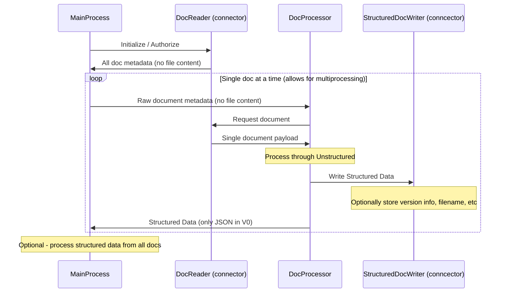

# Batch Processing Documents

## Sample Connector: S3

See the sample project [examples/ingest/s3-small-batch/main.py](examples/ingest/s3-small-batch/main.py), which processes all the documents under a given s3 URL with 2 parallel processes, writing the structured json output to `structured-outputs/`.

You can try it out with:

    PYTHONPATH=. python examples/ingest/s3-small-batch/main.py --s3-url s3://utic-dev-tech-fixtures/small-pdf-set/ --anonymous

    # Note: the --anonymous flag indicates not to provide AWS credentials, needed 
    # for the boto3 lib. Remove this flag when local AWS credentials are required.

This utility is ready to use with any s3 prefix!

By default, it will not reprocess files from s3 if their outputs already exist in --structured-ouput-dir. Natrually, this may come in handy when processing a large number of files. However, you can force reprocessing all documents with the --reprocess flag. 


```
$ PYTHONPATH=. python examples/ingest/s3-small-batch/main.py --help
Usage: main.py [OPTIONS]

Options:
  --s3-url TEXT                   Prefix of s3 objects (files) to download.
                                  E.g. s3://bucket1/path/. This value may also
                                  be a single file.
  --re-download / --no-re-download
                                  Re-download files from s3 even if they are
                                  already present in --download-dir.
  --download-dir TEXT             Where s3 files are downloaded to, defaults
                                  to tmp-ingest-<6 random chars>.
  --preserve-downloads            Preserve downloaded s3 files. Otherwise each
                                  file is removed after being processed
                                  successfully.
  --structured-output-dir TEXT    Where to place structured output .json
                                  files.
  --reprocess                     Reprocess a downloaded file from s3 even if
                                  the relevant structured output .json file in
                                  --structured-output-dir already exists.
  --num-processes INTEGER         Number of parallel processes to process docs
                                  in.  [default: 2]
  --anonymous                     Connect to s3 without local AWS credentials.
  -v, --verbose
  --help                          Show this message and exit.
```

# Developer notes

## The Abstractions



The abstractions in the above diagram are honored in the S3 Connector project (though ABC's are not yet written), with the exception of the StructuredDocWriter which may be added more formally at a later time.
