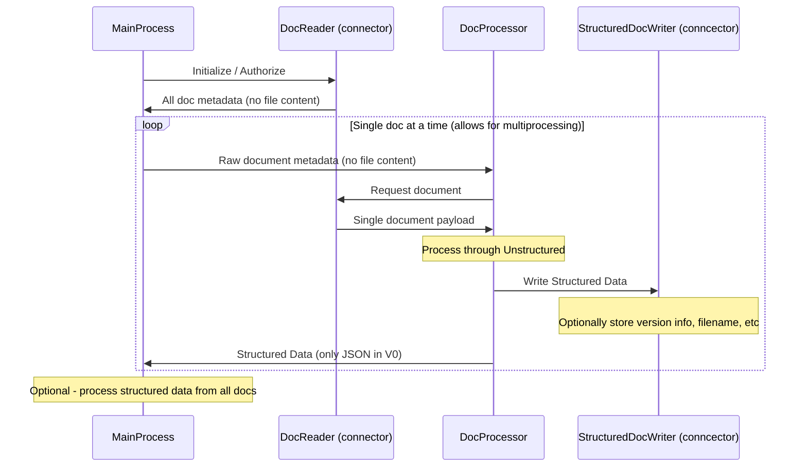

# Batch Processing Documents

Several classes are provided in the Unstructured library
to enable effecient batch processing of documents.

## The Abstractions

## Sample Connector: S3

See the sample project [examples/ingest/s3-small-batch/main.py](examples/ingest/s3-small-batch/main.py), which processes all the documents under a given s3 URL with 2 parallel processes, writing the structured json output to `structured-outputs/`.

The abstractions in the above diagram are honored in this project (though ABC's are not yet written), with the exception of the StructuredDocWriter which may be added more formally at a later time.
