AWS Marketplace Deployment Guide
================================

This guide provides step-by-step instructions for deploying Unstructured API from AWS Marketplace.

Pre-Requirements
----------------

1. **AWS Account**: Register at `AWS Registration Page <https://aws.amazon.com/>`_, if you don't have an AWS account.

2. **IAM Permissions**: Ensure permissions for ``CloudFormation``.

   - Refer to this `AWS blog post <https://blog.awsfundamentals.com/aws-iam-roles-with-aws-cloudformation#heading-creating-iam-roles-with-aws-cloudformation>`_ to create IAM Roles with CloudFormation.

3. **SSH KeyPair**: Create or use an existing KeyPair for secure access.

   - Follow the ``Create Key Pairs`` in the Amazon EC2 `User Guide <https://docs.aws.amazon.com/AWSEC2/latest/UserGuide/create-key-pairs.html>`_.

Part I: Setting Up a Virtual Private Cloud (VPC)
------------------------------------------------

*Note: If you have already configured a Virtual Private Cloud (VPC) for your organization that meets the requirements for deploying the Unstructured API, you may skip this part and proceed to the Part II. Ensure that your existing VPC setup includes the necessary subnets, Internet Gateway, and route tables as outlined in this guide.*

In Part 1, we will construct a resilient and secure infrastructure within AWS by setting up a Virtual Private Cloud (VPC). Our VPC will encompass a dual-tiered subnet model consisting of both **public** and **private** subnets across multiple Availability Zones (AZs).

We will establish the foundational network structure for deploying the Unstructured API by creating two public subnets and one private subnet within our VPC. The public subnets will host resources that require direct access to the internet, such as a load balancer, enabling them to communicate with external users. The private subnet is designed for resources that should not be directly accessible from the internet, like EC2 Compute Engine.

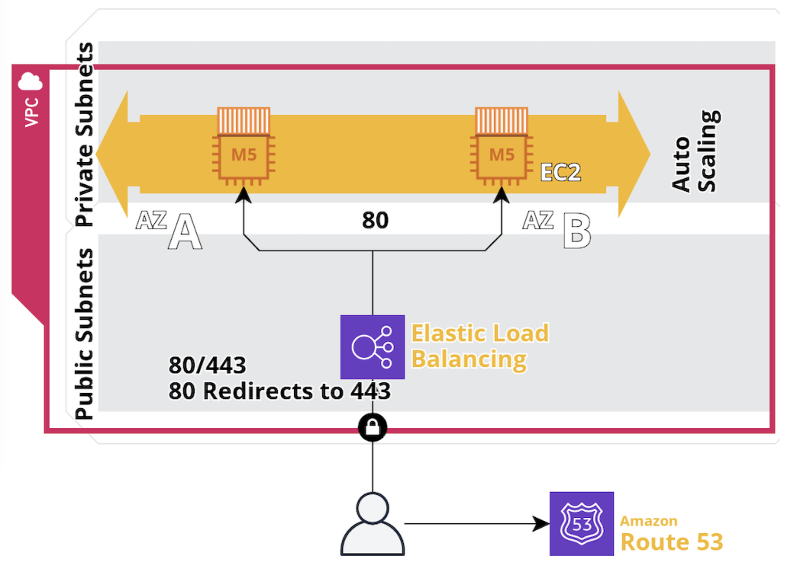

**Step-by-Step Process:**

1. **Access VPC Dashboard**:

   - In the AWS Management Console, navigate to the VPC service.
   - Click “Your VPCs” in the left navigation pane, then “Create VPC.”

2. **Create VPC**:

   - Select ``VPC only``
   - Enter a ``Name tag`` for your VPC.
   - Specify the IPv4 CIDR block (e.g., 10.0.0.0/16).

     - You may leave the IPv6 CIDR block, Tenancy, and Tags settings as default.
   - Click “Create VPC” button

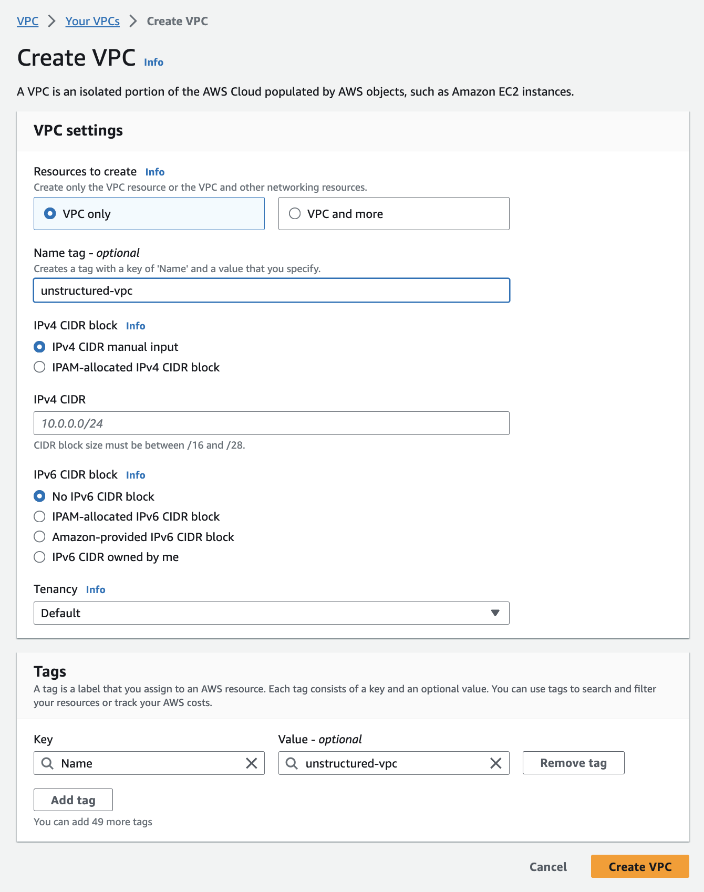

3. **Create Subnets**:

   - After creating the VPC, click “Subnets” in the left navigation pane.
   - Click “Create subnet” and select the VPC you just created from the dropdown menu.
   - For the first public subnet:

     - Enter a ``Name tag``.
     - Select an ``Availability Zone``.
     - Specify the IPv4 CIDR block (e.g., 10.0.0.0/16).
     - Specify the IPv4 subnet CIDR block (e.g., 10.0.1.0/24).
     - You may the Tags settings as default.
     - Click ``Add new subnet``.
   - Repeat the process for the second public subnet with a different Availability Zone and CIDR block (e.g., 10.0.2.0/24).

     - *Note: Each subnet must reside entirely within one Availability Zone and cannot span zones*.
     - Ref: AWS documentation on `Subnet basics <https://docs.aws.amazon.com/vpc/latest/userguide/configure-subnets.html#subnet-basics>`_.
   - For the private subnet:

     - Follow the same steps, but choose a different Availability Zone and IPv4 subnet CIDR block (e.g., 10.0.3.0/24).

   - Click ``Create subnet``.

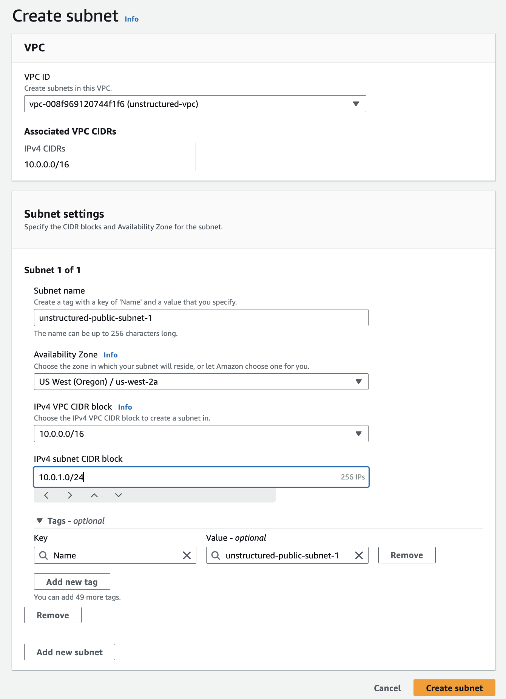

4. **Create Internet Gateway (for Public Subnets)**:

   - Go to “Internet Gateways” in the VPC dashboard.
   - Click “Create internet gateway,” enter a name, and create.

     - Note: we will attach the newly created internet gateway to your VPC in Step 6 - Edit Route.

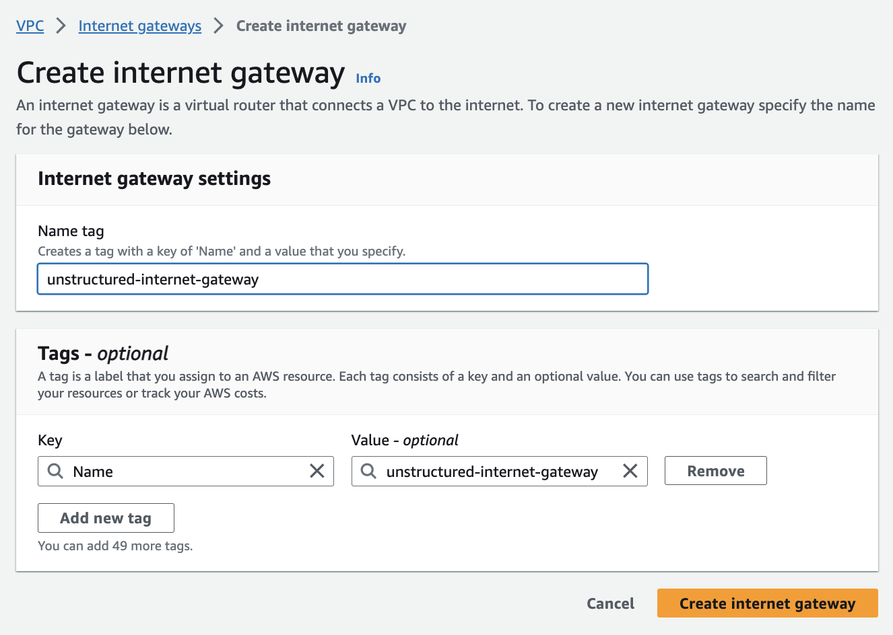

5. **Set Up Route Tables (for Public Subnets)**: *AWS automatically creates a default Route Table in Step 3 above. To tailor our network architecture, we will create a new Route Table specifically for our public subnets, which will include a route to the Internet Gateway from Step 4 above.*

   - Click "Route tables" in the left navigation pane.
   - Click “Create route table” in the dashboard.
   - Enter a ``Name``.
   - Select the ``VPC`` from Step 2 above.
   - Click ``Create route table``

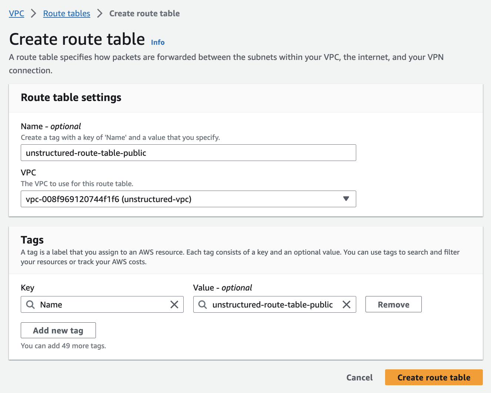

6. **Associate Public Subnets to the Route Table and Internet Gateway**:

   - Click on “Your VPCs” in the left navigation pane.
   - Select the VPC that you just created in Step 2.
   - Connect the **public subnets** to the **route table** from Step 5.

     - Click the 'Subnets' page in the left navigation pane.
     - Select the public subnet from Step 3.
     - Click ``Actions`` button on the top right-hand corner
     - Select ``Edit route table association`` from the Actions dropdown menu
     - On the ``Edit route table association`` page, select the route table designed for public subnets from Step 5 and save the changes.
     - Repeat the process for the second public subnets.

   - Now, we'll ensure that the public subnets can access the internet by connecting the Route table to Internet Gateway

     - Click the 'Route tables' page in the left navigation pane.
     - Select the ``route table`` that you created in Step 5.
     - Click ``Actions`` button on the top right-hand corner
     - Select ``Edit routes`` from the Actions dropdown menu
     - Choose 'Add route', and in the destination box, enter **0.0.0.0/0** which represents all IP addresses.
       - In the target box, select the ``Internet Gateway`` you've configured in Step 4.
     - Click ``Save changes`` to establish the route, granting internet access to the public subnets.

   - For the **private subnet**, use the main route table or create a new one without a route to the internet gateway.

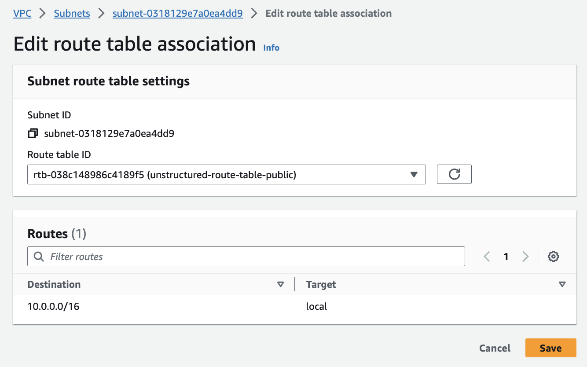

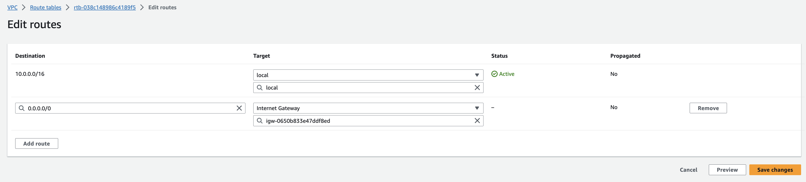

7. **Inspect VPC Resource Map**:

   You can check the configurations from the Resource Maps on the VPC Details dashboard.

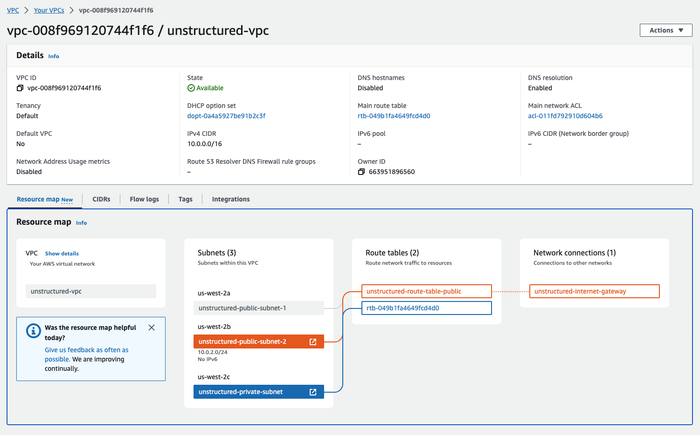

Part II: Deploying Unstructured API from AWS Marketplace
--------------------------------------------------------

8. **Visit the Unstructured API page on AWS Marketplace**

   - Link: `Unstructured API Marketplace <http://aws.amazon.com/marketplace/pp/prodview-fuvslrofyuato>`_.
   - Click ``Continue to subscribe``
   - Review Terms and Conditions
   - Click ``Continue to Configuration``

.. image:: imgs/AWS/Marketplace_Step8.png
  :align: center
  :alt: Unstructured API on AWS Marketplace

9. **Configure the CloudFormation**

   - Select ``CloudFormation Template`` from the Fulfillment option dropdown menu.
   - Use the default ``Unstructured API`` template and software version.
   - Select the ``Region``

     - *Note: It is important to select the same region where you set up the VPC in Part 1.*
   - Click ``Continue to Launch`` button.
   - Select ``Launch CloudFormation`` from Choose Action dropdown menu.
   - Click ``Launch`` button.

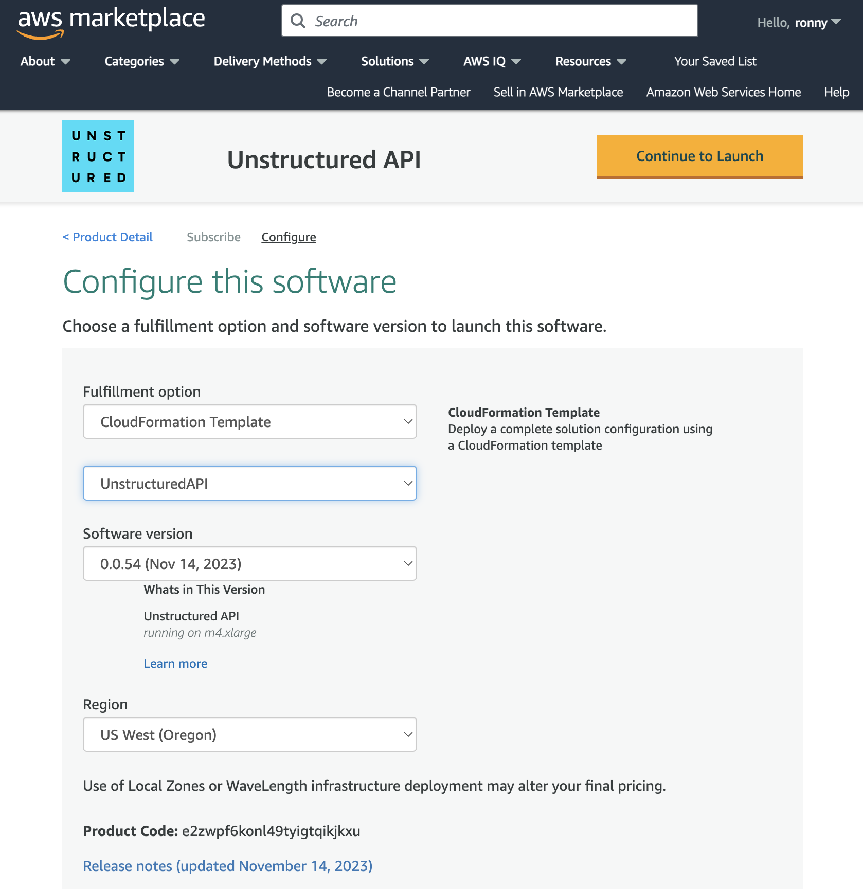

10. **Create Stack on CloudFormation**

    The Launch button will redirect to ``Create stack`` workflow in the CloudFormation.

    **Step 1: Create stack**

    - Select the ``Template is ready``
    - Use the default template source from ``Amazon S3 URL``
    - Click ``Next`` button.

    .. image:: imgs/AWS/Marketplace_Step10a.png
        :align: center
        :alt: Create Stack

    **Step 2: Specify stack details**

    - Provide ``stack name``
    - In the **Parameters** section, provide the ``KeyName`` - see the Pre-Requirements, if you haven't created an EC2 Key Pair.
    - Specify ``LoadBalancerScheme`` to **internet-facing**
    - Set the ``SSHLocation`` to  **0.0.0.0/0**, only if you allow public access on the Internet.

      - **Note**: It is generally recommended to limit SSH access to a specific IP range for enhanced security. This can be done by setting the ``SSHLocation`` to the IP address or range associated with your organization. Please consult your IT department or VPN vendor to obtain the correct IP information for these settings.
      - AWS provides ``AWS Client VPN``, which is a managed client-based VPN service that enables secure access AWS resources and resources in your on-premises network. For more information, please refer to `Getting started with AWS Client VPN <https://docs.aws.amazon.com/vpn/latest/clientvpn-admin/cvpn-getting-started.html>`_.
    - Select the ``Subnets`` and ``VPC`` from the Part 1 above.
    - You can use the default values for other Parameter fields
    - Click ``Next`` button.

    .. image:: imgs/AWS/Marketplace_Step10b.png
        :align: center
        :alt: Specify stack details

    **Step 3: Configure stack options**

    - Specify the stack options or use default values.
    - Click ``Next`` button.

    .. image:: imgs/AWS/Marketplace_Step10c.png
        :align: center
        :alt: Specify stack options

    **Step 4: Review**

    - Review the Stack settings.
    - Click ``Submit`` button.

    .. image:: imgs/AWS/Marketplace_Step10d.png
        :align: center
        :alt: Review stack

11. **Get the Unstructured API Endpoint**

    - Check the status of the CloudFormation stack.

      - A successful deployment will show ``CREATE_COMPLETE`` status.
    - Click ``Resources`` tab and click the ``ApplicationLoadBalancer``.
    - You will be redirected to ``EC2 Load Balancer`` page and click the Load Balancer created by the Cloud Formation from the previous step.
    - On the Load Balance detail page, copy the ``DNS Name``, shown as ``A Record`` and suffix ``elb.amazonaws.com``.

      - Note: You will use this ``DNS Name`` to replace the ``<api_url>`` for the next steps, i.e., Healthcheck and Data Processing.

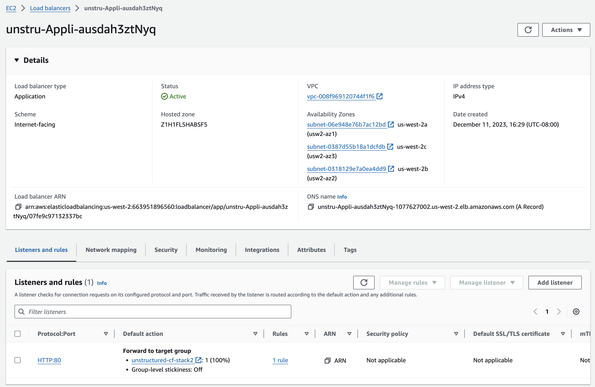

Healthcheck
-----------

Perform a health check using the curl command:

.. code-block:: bash

    curl https://<api_url>/healthcheck

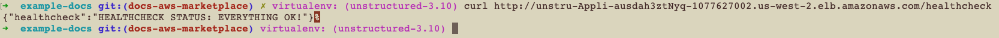

Data Processing
---------------

Data processing can be performed using curl commands.

- Note: you will need to add the suffix to the endpoint: **/general/v0/general**

.. code-block:: bash

    curl -X 'POST' 'https://<api_url>/general/v0/general'
         -H 'accept: application/json'
         -H 'Content-Type: multipart/form-data'
         -F 'files=@sample-docs/family-day.eml'
         | jq -C . | less -R

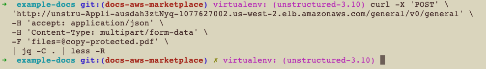

Getting Started with Unstructured
---------------------------------

Explore examples in the Unstructured GitHub repository: `Unstructured GitHub <https://github.com/Unstructured-IO/unstructured>`_.

Support
-------

For support inquiries, contact: `support@unstructured.io <mailto:support@unstructured.io>`_
