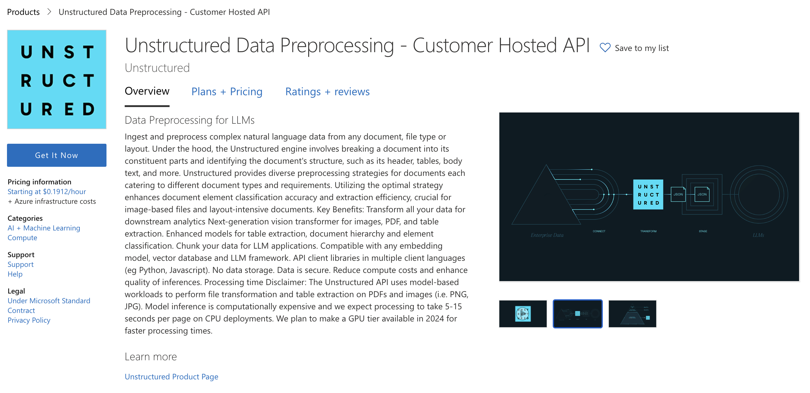
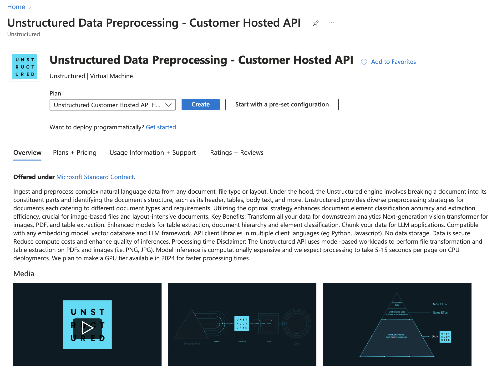
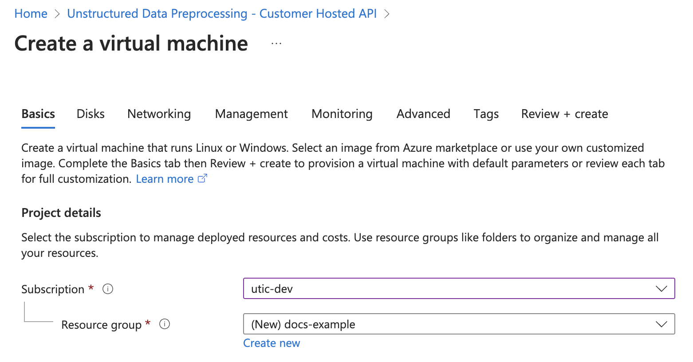
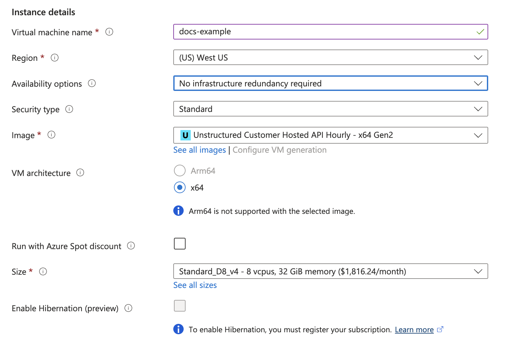
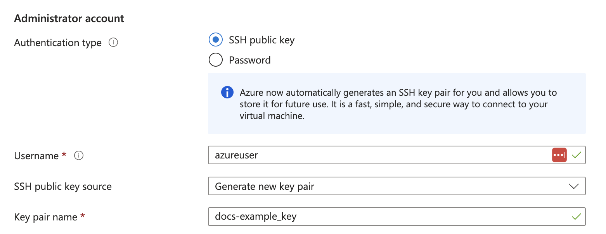
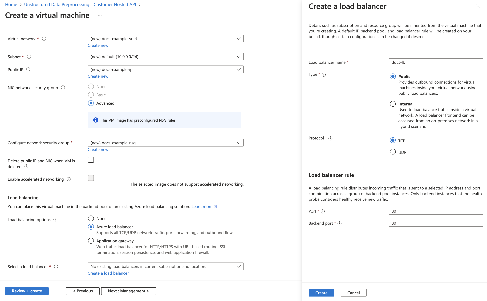
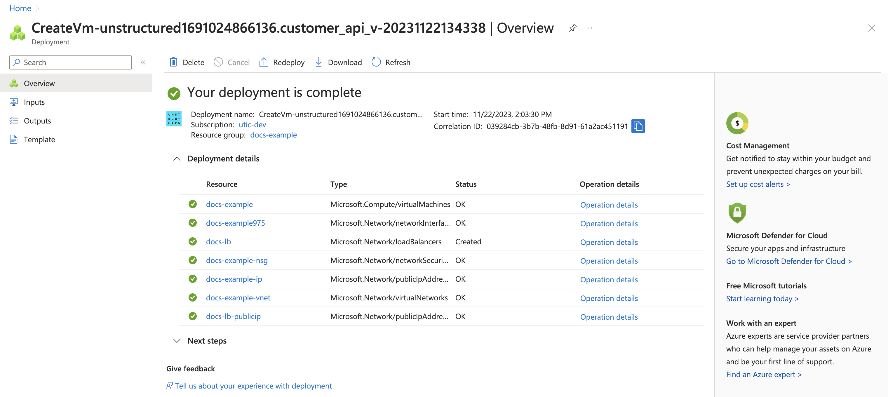
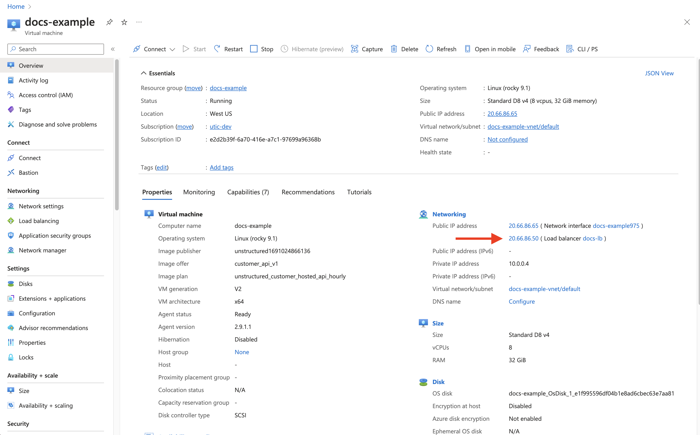
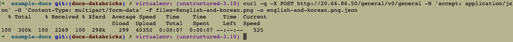

Azure Marketplace Deployment Guide
===================================

Introduction
------------
This guide provides step-by-step instructions for deploying a service on Azure using the Azure Marketplace.

1. Login to Azure Portal
------------------------
- **URL**: `https://portal.azure.com <https://portal.azure.com/>`__.

2. Access Azure Marketplace
---------------------------
- Navigate to the Azure Marketplace using `this URL <https://azuremarketplace.microsoft.com/en-us/marketplace/apps/unstructured1691024866136.customer_api_v1?tab=Overview/>`__.

3. Start Deployment Process
---------------------------
- Click the **Get it Now** button and fill out the form.
- Read the Terms and click **Continue**.
- Click **Create** button.

4. Configure Deployment Options
-------------------------------

On the **Create a virtual machine** page, go to **Basics** tab and follow the steps below.

- Project details
    - Select **Subscription** and **Resource group** from dropdown menu.
    - Or, you can also ``Create New`` resource group.

- Instance details
    - Provide a name in the **Virtual machine name** field.
    - Select a **Region** from the dropdown menu.
    - **Image**: Select ``Unstructured Customer Hosted API Hourly - x64 Gen2`` (*default*)
    - **Size**: Select VM size from dropdown menu.

- Administrator account
    - **Authentication type**: Select ``Password`` or ``SSH public key``.
    - Enter the ``credentials``.

5. Set Up Load Balancer
-----------------------

On the **Create a virtual machine** page, go to **Networking** tab and follow the steps below.

- Networking interface (required fields)
    - **Virtual network**: Select from dropdown menu or create new
    - **Subnet**: Select from dropdown menu
    - **Configure network security group**: Select from dropdown menu or create new

- Load balancing
    - **Load balancing option**: Select ``Azure load balancer``
    - **Select a load balance**: Select from dropdown menu or create new
        - **Type**: Select ``Public`` or ``Internal``
        - **Protococl**: Select ``TCP`` or ``UDP``
        - **Port** and **Backend Port**: Set to ``port 80``

6. Finalize and Deploy
----------------------
- Click **Review + Create**.
- Wait for validation.
- Click **Create**.

7. Post-Deployment Steps
------------------------
- Go to the **Virtual Machine** from Azure console.
- Retrieve the **Load balancer public IP address**
- The deployed endpoint is **http://<load-balancer-public-IP-address>/general/v0/general**

7. Verification and Testing
---------------------------
- Navigate to the public IP with the specified path for documentation and API testing.
- Perform API testing with `curl` commands.

.. code-block:: bash

  curl -q -X POST http://<you-IP-address>/general/v0/general -H 'accept: application/json' -H 'Content-Type: multipart/form-data' -F files=@english-and-korean.png -o /tmp/english-and-korean.png.json

