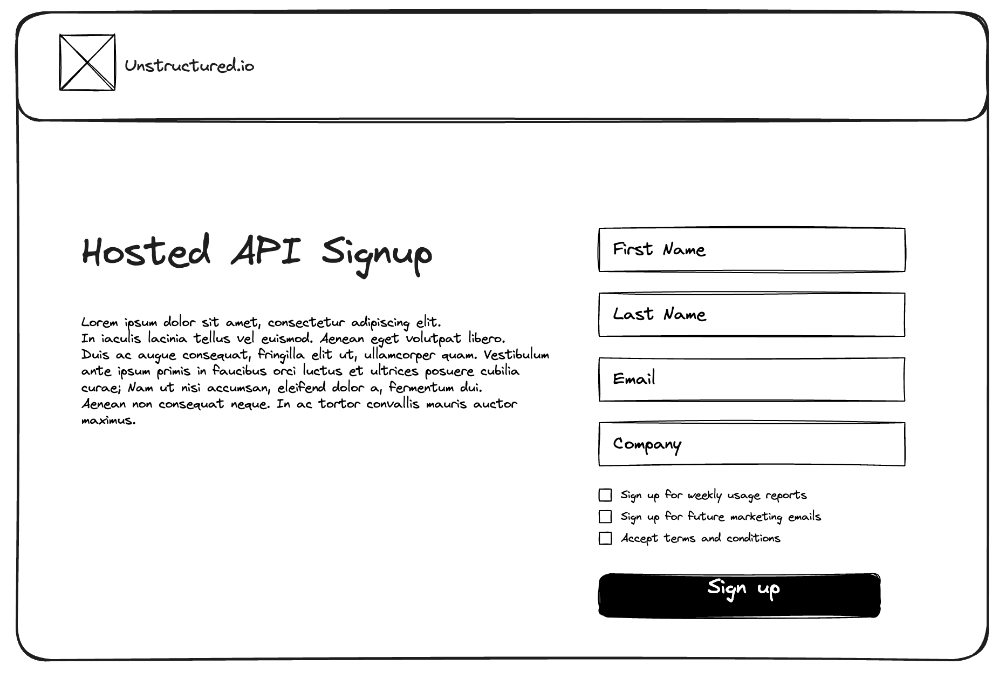
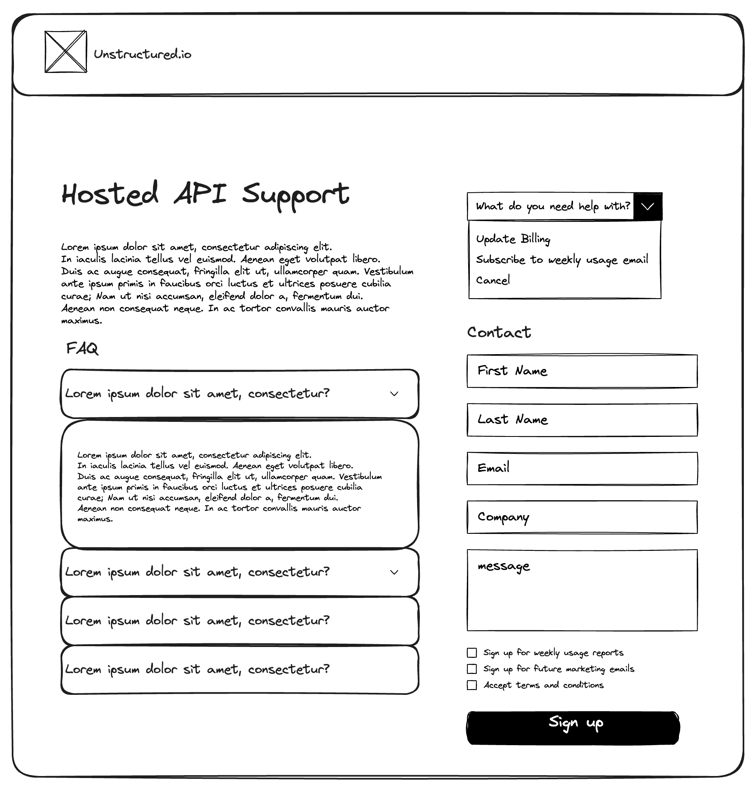

Hosted API Deployment Guide
===========================

This documentation serves as a guide for Unstructured Hosted API users to register, configure payment, and start using the Hosted API on the Unstructured platform. It contains all necessary instructions and resources to facilitate a smooth setup and deployment process.

New User Sign-up
----------------

#. Navigate to the "Hosted API Signup" section on our website.
#. Fill out the registration form with your personal details:

   - **First Name**: Enter your given name.
   - **Last Name**: Enter your family or surname.
   - **Email**: Provide a valid email address where we can send you confirmations and communications.
   - **Company**: Enter the name of your company or organization.

#. Optional Preferences:

   - [] Check the box to sign up for weekly usage reports.
   - [] Check the box to sign up for future marketing emails.

#. Terms and Conditions:

   - [] Read and accept our terms and conditions by checking the appropriate box to proceed.

#. Once all information is entered, and preferences and terms are accepted, click on the "Sign Up" button to create your account.

Email Confirmation and Payment Processing
-----------------------------------------

#. Upon successful sign-up, you will receive an email from Stripe.

   - There will be an initiation fee that will be collected upfront to all new users. Please refer to the pricing information page on our website.
#. Click "Pay this invoice" button in the email and follow the instructions to enter your payment details securely on Stripe website.
#. Confirm the payment to complete this process. Look out for any confirmation prompts or messages that signify a successful transaction.

   - Note that we don't send out a receipt. If you would like to keep a receipt, click "Download receipt" button after you complete the payment on Stripe.

Receiving API Key and Hosted API URL
------------------------------------

#. After your payment is processed, you will receive an email from us containing your unique API credentials.
#. Check your inbox (and the spam folder, just in case) for an email from our domain.
#. Save these credentials securely, as you will need them to access our API and integrate it with your applications.

Update Billing
--------------

If you need to update your billing information, fill out the "Update Billing" form as follows.

#. Select "Update Billing" from the "What do you need help with?" dropdown menu on our Support page.
#. Upon successful sign-up, you will be redirected to the Stripe payment page.
#. Follow the instructions to enter your payment details securely.
#. Confirm the payment to complete this process. Look out for any confirmation prompts or messages that signify a successful transaction.

.. image:: imgs/paid_api/update_billing.png
  :align: center
  :alt: Update Billing

Opt-in and Opt-out to Usage and Marketing Emails
------------------------------------------------

Cancel Billing
--------------

Support
-------

#. **Navigate to Support Request Form:**

   - The support page features a dropdown menu titled "What do you need help with?" Select an option that best describes your issue or inquiry, including:

     - Update Billing
     - Subscribe to weekly usage email
     - Cancel

#. **Support Form:**

   - To reach out to our support team, fill in the contact form on the support page with the following details:

     - **First Name**: Your given name.
     - **Last Name**: Your family or surname.
     - **Email**: Your email address where we can send you a response.
     - **Company**: If applicable, the name of your company or organization.
     - **Message**: The details of your support request or any additional information you wish to provide.

   - Below the contact form, you can select additional support options as needed:

     - [] Tick to sign up for weekly usage reports.
     - [] Tick to sign up for future marketing emails.
     - [] Tick to acknowledge that you have read and accepted the terms and conditions.

   - After filling out the form and selecting any additional options, click on the "Sign Up" button to submit your support request.

For any other assistance or queries, please contact our support team at `support@unstructured.io <mailto:support@unstructured.io>`_
