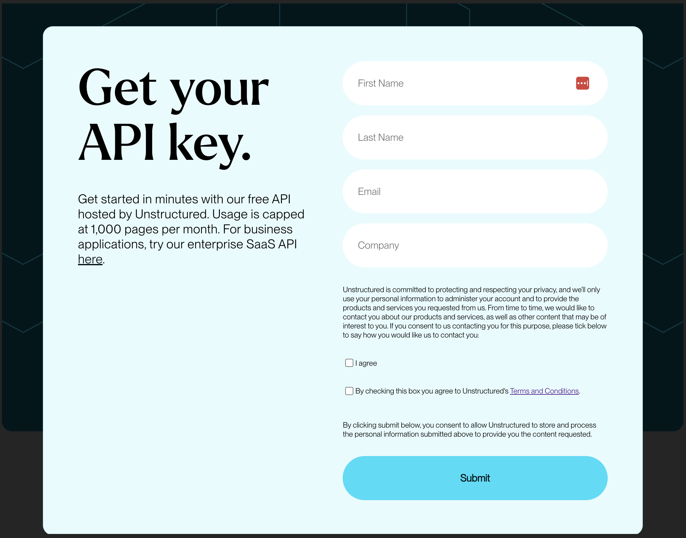
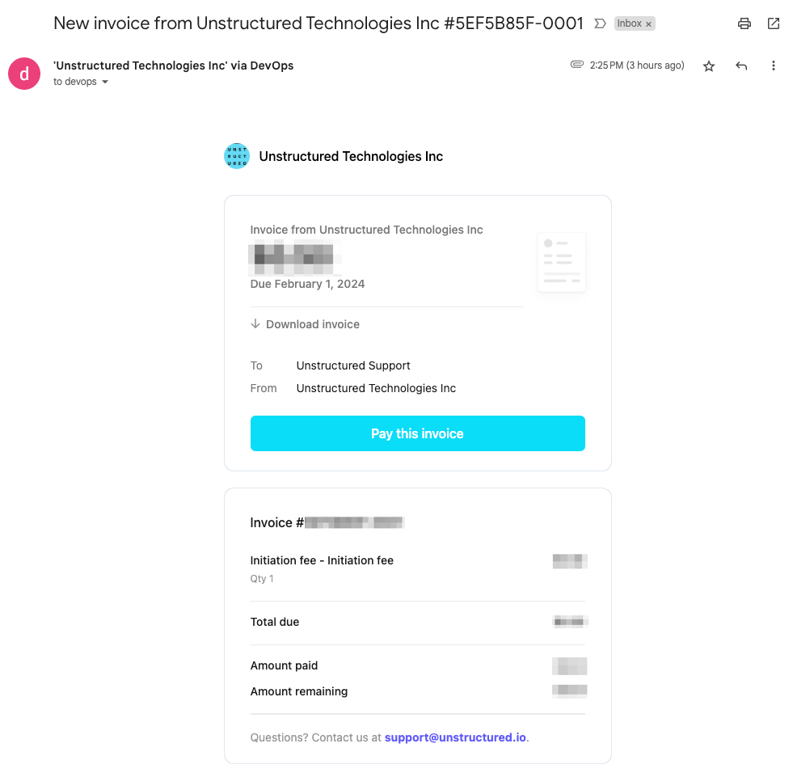
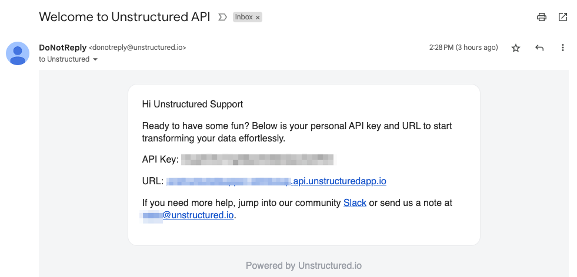
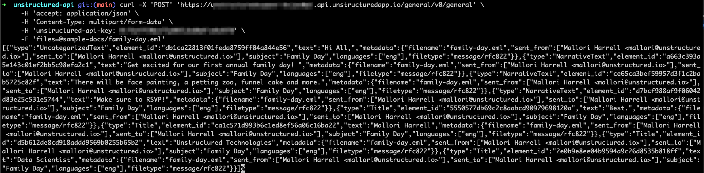
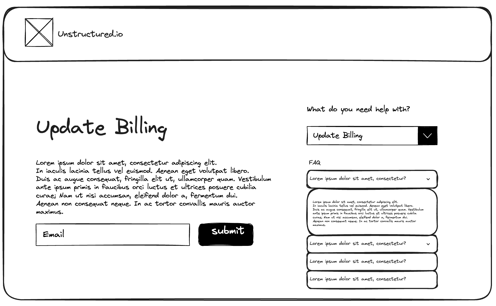
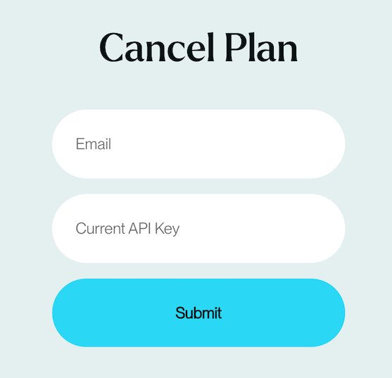
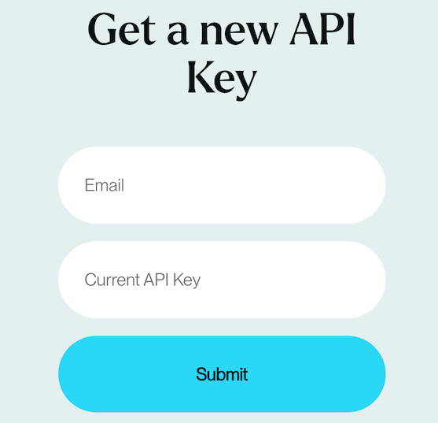

SaaS API Deployment Guide
=========================

This documentation serves as a guide for Unstructured SaaS API users to register, receive an API key and URL, and manage your account and billing information. It contains all the necessary instructions and resources to facilitate a smooth setup and deployment process of Hosted API on Unstructured infrastructure.

New User Sign-up
----------------

1. Navigate to the `Unstructured SaaS API <https://unstructured.io/api-key-hosted>`_ page on our website.
2. Fill out the registration form with your details:

   - **First Name**: Enter your given name.
   - **Last Name**: Enter your family or surname.
   - **Email**: Provide a valid email address where we can send you confirmations and communications.
   - **Company**: Enter the name of your company or organization.

3. Optional Preferences:

   - Check the box to sign up for future marketing emails and product updates.
   - Check the box to sign up for weekly usage usage emails.

4. Terms and Conditions:

   - Read and accept our terms and conditions by checking the appropriate box to proceed.

5. Click the "Sign Up" button to create your account.

Email Confirmation and Payment Processing
^^^^^^^^^^^^^^^^^^^^^^^^^^^^^^^^^^^^^^^^^

6. Upon successful sign-up, you will receive an email from Stripe.

   - There will be a small initiation fee for all new subscriptions. This one-time fee will be charged to your credit card to enable automatic billing.
7. Click the "Pay this invoice" button in the email and follow the instructions to enter your payment details securely on Stripe website.
8. Confirm the payment to complete this process. Look out for any confirmation prompts or messages that signify a successful transaction.

   - Note that we don't send out a receipt. If you want to keep a receipt, click the "Download invoice" button after completing the payment on Stripe.

Using the API Key and URL
^^^^^^^^^^^^^^^^^^^^^^^^^

1. After your payment is processed, you will receive an email from ``Unstructured`` containing your unique **API KEY** and **URL**.
2. Check your inbox (and the spam folder, just in case) for an email from our domain.
3. Save these credentials securely, as you will need them to access and integrate our API with your applications.

Example: Parsing a Document via SaaS API
^^^^^^^^^^^^^^^^^^^^^^^^^^^^^^^^^^^^^^^^

Please refer to the sample code and output provided below to begin processing documents with your SaaS API.

.. warning::
    When using the Command Line Interface (CLI), ensure that you copy the complete SaaS API URL provided in your email. This URL should include the specific path ``/general/v0/general``.

.. code-block:: bash

    # Make sure to replace the placeholders with the actual URL and API key from your email
    # Include the path `/general/v0/general` in the URL.

    curl -X 'POST' 'https://<REPLACE WITH THE URL IN THE EMAIL>'
         -H 'accept: application/json'
         -H 'Content-Type: multipart/form-data'
         -H 'unstructured-api-key: <REPLACE WITH API KEY IN THE EMAIL>'
         -F 'files=@sample-docs/family-day.eml'

.. warning::
    When using the Unstructured `Python SDK <https://github.com/Unstructured-IO/unstructured-python-client>`__ or `JavaScript SDK <https://github.com/Unstructured-IO/unstructured-js-client>`__, it is important to **omit** the path ``/general/v0/general`` from the ``server_url`` parameter. Additionally, ensure you use ``https`` in the URL to prevent potential errors.

.. code-block:: python

    from unstructured_client import UnstructuredClient

    # Remember NOT to include `/general/v0/general` in the `server_url`
    s = UnstructuredClient(api_key_auth="<YOUR_API_KEY>",  # Replace <YOUR_API_KEY> with the API key provided in the email
                           server_url="<YOUR_SERVER_URL>") # Replace <YOUR_SERVER_URL> with the server URL provided in the email

SaaS API Account Maintenance
-----------------------------

Opt-in to Usage Emails
^^^^^^^^^^^^^^^^^^^^^^

To receive regular updates on usage statistics, please follow these steps:

1. From the `Unstructured SaaS API <https://unstructured.io/api-key-hosted>`_ webpage, navigate to FAQ section and click the "Subscribe to Usage Updates" link.
2. Enter your email address in the provided field.
3. Click the "Submit" button to complete the subscription process.

You will start receiving the weekly usage email after your submit the form. To opt-out from the email subscription, please contact our Support team at `support@unstructured.io <mailto:support@unstructured.io>`_.

.. image:: imgs/paid_api/opt-in.png
  :align: center
  :alt: Opt-in Email

Update Payment Method
^^^^^^^^^^^^^^^^^^^^^

If you need to update your billing information, fill out the "Update Billing" form.

1. From the `Unstructured SaaS API <https://unstructured.io/api-key-hosted>`_ webpage, navigate to FAQ section and click the "Update Payment Method" link.
2. Enter your email address in the provided field.
3. Click the "Submit" button to complete the subscription process.

Upon successful form submission, you will be redirected to the Stripe payment page. Follow the instructions to enter your payment details securely. Confirm the payment to complete this process.

Please note that there will be a nominal fee charged to your credit card to verify the payment method. Stripe will refund this fee once the new payment method is confirmed. You will receive a confirmation email about the refund. We will use this new payment method for your next invoices.

Cancel Plan
^^^^^^^^^^^

To cancel your current plan, please complete the following steps:

1. From the `Unstructured SaaS API <https://unstructured.io/api-key-hosted>`_ webpage, navigate to FAQ section and click the "Cancel Plan" link.
2. When the pop-up form appears, provide your registered **Email** in the first field.
3. Enter your **Current API Key** in the following field.
4. Click the **Submit** button to send your cancellation request.

Upon submission, our team will process your request, and you will receive a confirmation email regarding the cancellation of your plan.

.. note:: Please contact our Support team at `support@unstructured.io <mailto:support@unstructured.io>`_, if you need to re-register Unstructured SaaS API using the same email address after you cancel your plan.

Rotate a New API Key
^^^^^^^^^^^^^^^^^^^^

If you need to rotate your API key for security reasons or API key regeneration, follow these steps:

1. From the `Unstructured SaaS API <https://unstructured.io/api-key-hosted>`_ webpage, navigate to FAQ section and click the "Get a new API Key" link.
2. Type your registered **Email** address in the corresponding input field.
3. Provide your **Current API Key** in the specified field.
4. Press the **Submit** button to initiate the API key rotation process.

Once you submit the form, our system automatically generates a new API key and deactivates the old one. You will receive the new API key at your registered email address. Be sure to update your applications with the new API key to maintain access to the API services.

Get Support
-----------

1. Navigate to FAQ section on `Unstructured SaaS API <https://unstructured.io/api-key-hosted>`_ webpage.
2. For any other assistance or queries, please get in touch with our Support team at `support@unstructured.io <mailto:support@unstructured.io>`_.