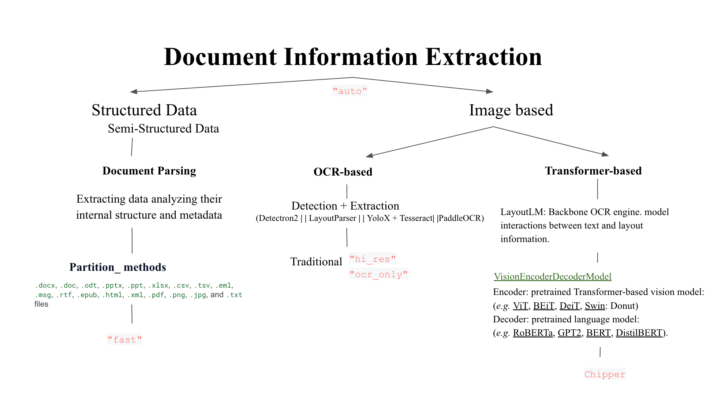

Best Practices
==============

Unstructured offers a few strategies and models to extract document information. These best practices are intended to provide guidelines to configure the ``strategy`` and ``model`` configurations to optimize document information extraction.

High-level overview of available strategies and models in ``Unstructured`` library:

.. toctree::
   :maxdepth: 1

   best_practices/strategies
   best_practices/models
   best_practices/table_extraction_pdf
