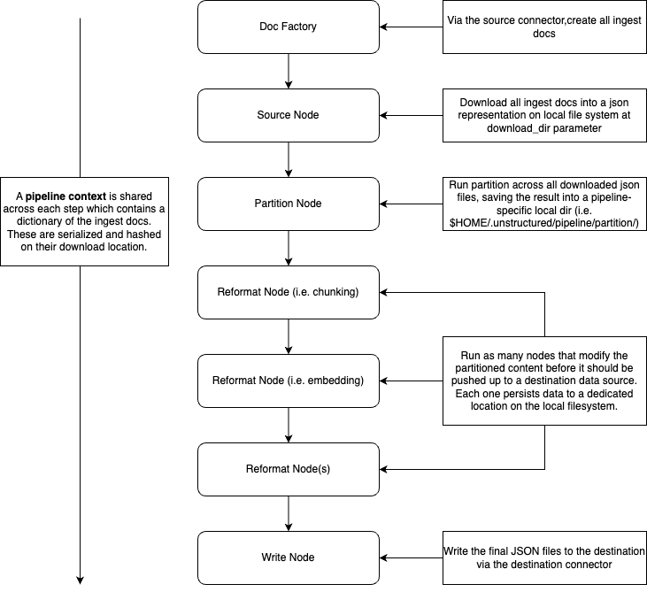

Ingest
=========================

The Ingest Library is a powerful tool designed to coordinate the process of
pulling data from data providers, partitioning the content, and pushing that
new content to a desired location. This technical documentation will provide
an in-depth understanding of the Ingest Library, including its features, architecture,
installation, configuration, usage, API reference, troubleshooting, examples, and more.

Library Documentation
---------------------

:doc:`source_connectors`
  Connect to your favorite data storage platforms for an effortless batch processing of your files.

:doc:`destination_connectors`
  Connect to your favorite data storage platforms to write you ingest results to.

:doc:`configs`
  Each configuration used when generating an ingest process.

Features
---------------------
The Ingest Library/CLI offers the following key features:

* Data Ingestion: Facilitates the ingestion of data from various sources, such as databases, APIs, files, or streaming services.
* Partitioning: Efficiently partitions data to extract relevant text data.
* Customization: Allows users to define data sources, ingestion processes, and destination targets.
* Fault Tolerance: Provides mechanisms for handling errors and retries during data ingestion.
* Scalability: Scales horizontally to accommodate large volumes of data.
* Logging: Offers comprehensive logging and monitoring capabilities to track the ingestion process.

Architecture
---------------------

The Ingest Library follows a modular architecture comprising the following components:

* Source Connectors: These components are responsible for fetching data from external sources, which can include databases, web services, file systems, or data streams.
* Partitioning Engine: This component optimally partitions the incoming data into dedicated ``Elements`` for processing and distribution.
* Reformatters: Optional steps supported to manipulate the partitioned content output, such as chunking and adding embeddings.
* Destination Connectors: These components send the partitioned data to the desired destination, which could be a database, data warehouse, cloud storage, or any other user-defined target.
* The library's modular architecture provides flexibility and extensibility, allowing users to integrate custom components and adapt the library to their specific needs.

Installation
---------------------

To install the Ingest Library, follow these steps:

#. Run ``pip install unstructured`` to install the latest version of the unstructured library which include the ingest code and the cli.
#. For specific connectors, run ``pip install unstructured[CONNECTOR_DEPS]`` where ``CONNECTOR_DEPS`` references the extra dependency label for a particular connector. For example, ``pip install unstructured[s3]`` will install the dependencies to interact with the s3 connectors. If these aren't installed before hand, a convenient error message will be printed for you when you run the ingest CLI for the first time, prompting you with the correct pip command to run.
#. Once installed, you can run ``unstructured-ingest --help`` to get all the available commands.

Configuration
---------------------

The Ingest Library requires configuration to define data sources, ingestion processes, and destination targets. For the CLI,
configuration is done through the various cli parameters supported. When the library is run in python, those parameters that are
exposed in the CLI map to python config classes, which are described in more detail in the configs section.

.. Hidden TOCs

.. toctree::
   :caption: Documentation
   :maxdepth: 1
   :hidden:

   source_connectors
   destination_connectors
   configs
