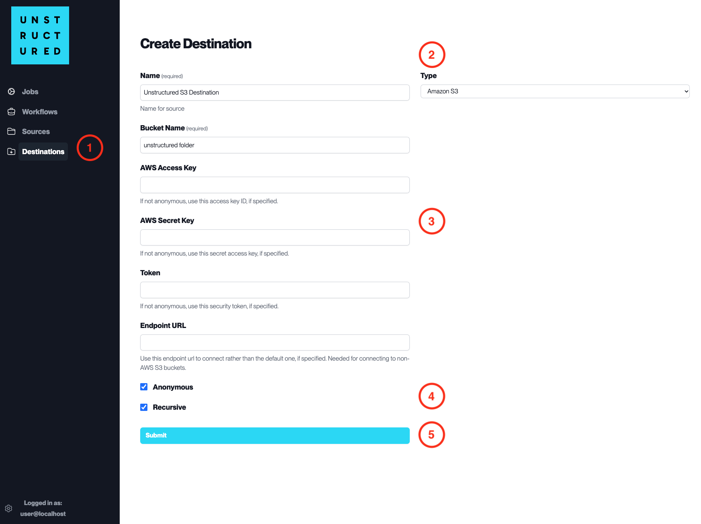

Amazon S3
=========

This page contains the information to store processed data to Amazon S3.

Prerequisites
--------------

- Amazon S3 Bucket Name
- AWS Access and Secret Keys (if not using anonymous access)
- Token (if required for temporary security credentials)

For more information, please refer to `Amazon S3 documentation <https://docs.aws.amazon.com/AmazonS3/latest/userguide/Welcome.html>`__.

Step-by-Step Guide
-------------------

1. **Access the Create Destination Page**. Navigate to the "Destinations" section within the platform's side navigation menu and click on "New Destination" to initiate the setup of a new destination for your processed data.

2. **Select Destination Type**. Select **Amazon S3** destination connector from the ``Type`` dropdown menu.

3. **Configure Destination Details**

  - ``Name`` (*required*): Assign a descriptive name to the new destination connector.
  - ``Bucket Name`` (*required*): Enter the name of your Amazon S3 bucket.
  - ``AWS Access Key``: Input your AWS access key ID if your bucket is private.
  - ``AWS Secret Key``: Enter your AWS secret access key corresponding to the access key ID.
  - ``Token``: If required, provide the security token for temporary access.
  - ``Endpoint URL``: Specify a custom URL if connecting to a non-AWS S3 service.

4. **Additional Settings**

  - Check ``Anonymous`` if you are connecting without AWS credentials.
  - Check ``Recursive`` if you want the platform to store data recursively into sub-folders within the bucket.

5. **Submit**. Review all the details entered to ensure accuracy. Click 'Submit' to finalize the creation of the Destination Connector. The newly completed Amazon S3 connector will be listed on the Destinations dashboard.
