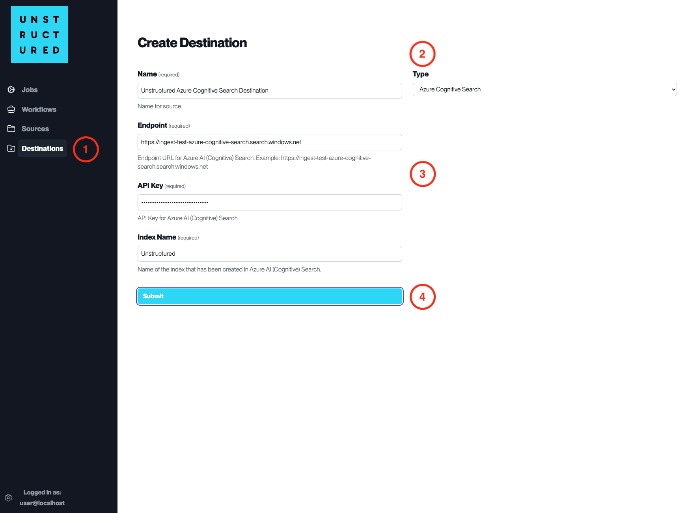

Azure Cognitive Search
======================

This page contains the information to store processed data to Azure Cognitive Search.

Prerequisites
--------------

- API Key for Azure Cognitive Search
- Azure Cognitive Search Index and Endpoint

For more information, please refer to `Azure Cognitive Search documentation <https://docs.microsoft.com/en-us/azure/search/>`__.

.. warning::
    Ensure that the index schema is compatible with the data you intend to write.
    If you need guidance on structuring your schema, consult the `sample index schema  <https://unstructured-io.github.io/unstructured/ingest/destination_connectors/azure_cognitive_search.html#sample-index-schema>`__ for reference.

Step-by-Step Guide
-------------------

1. **Access the Create Destination Page**. Navigate to the "Destinations" section within the platform's side navigation menu and click on "New Destination" to initiate the setup of a new destination for your processed data.

2. **Select Destination Type**. Select **Azure Cognitive Search** destination connector from the ``Type`` dropdown menu.

3. **Configure Destination Details**

  - ``Name`` (*required*): Assign a descriptive name to the new destination connector.
  - ``Endpoint`` (*required*): Enter the endpoint URL for your Azure Cognitive Search service.
  - ``API Key`` (*required*): Provide the API key for your Azure Cognitive Search service.
  - ``Index Name`` (*required*): Input the name of the index where the data will be stored.

4. **Submit**. Review all the details entered to ensure accuracy. Click 'Submit' to finalize the creation of the Destination Connector. The newly completed Azure Cognitive Search connector will be listed on the Destinations dashboard.

