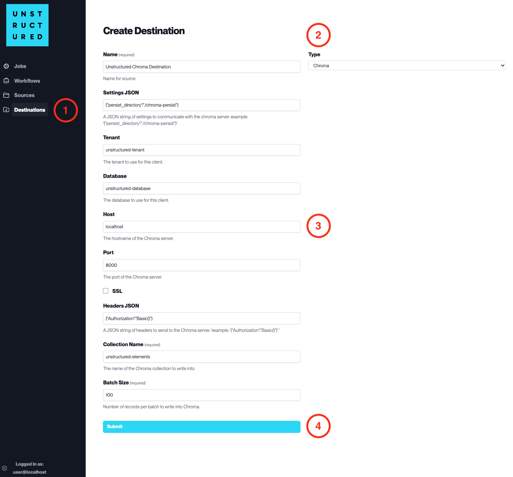

Chroma
======

This page contains the information to store processed data to a Chroma instance.

Prerequisites
--------------

- ChromaDB Installation

For more information, please refer to `Chroma documentation <https://docs.trychroma.com/getting-started>`__.

Step-by-Step Guide
-------------------

1. **Access the Create Destination Page**. Navigate to the "Destinations" section within the platform's side navigation menu and click on "New Destination" to initiate the setup of a new destination for your processed data.

2. **Select Destination Type**. Select **Chroma** destination connector from the ``Type`` dropdown menu.

3. **Configure Destination Details**

  - ``Name`` (*required*): Assign a descriptive name to the new destination connector.
  - ``Settings JSON``: Input the JSON string of settings to communicate with the Chroma server.
  - ``Tenant``: Specify the tenant to use for this client.
  - ``Database``: Enter the name of the database to use for this client.
  - ``Host``: Provide the hostname of the Chroma server.
  - ``Port``: Indicate the port of the Chroma server.
  - Check ``SSL`` if an SSL connection is required.
  - ``Headers JSON``: Enter a JSON string of headers to send to the Chroma server.
  - ``Collection Name`` (*required*): Specify the name of the collection to write into.
  - ``Batch Size`` (*required*): Define the number of records per batch to write into Chroma.

4. **Submit**. Review all the details entered to ensure accuracy. Click 'Submit' to finalize the creation of the Destination Connector. The newly completed Chroma connector will be listed on the Destinations dashboard.
