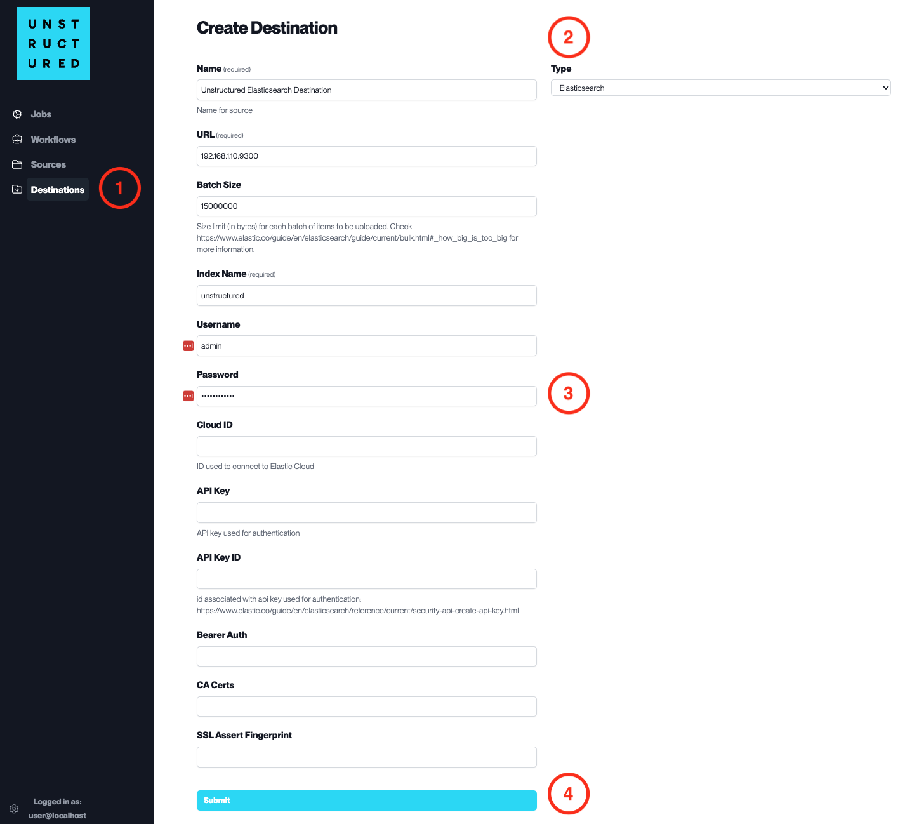

Elasticsearch
=============

This page contains the information to store processed data to an Elasticsearch cluster.

Prerequisites
--------------

- Elasticsearch Local Install or Cloud Service
- Index Name
- Username and Password for Elasticsearch access (if required)
- Cloud ID (if using Elastic Cloud)
- API Key and API Key ID for authentication (if required)

For more information, please refer to `Elasticsearch documentation <https://www.elastic.co/guide/en/elasticsearch/reference/current/index.html>`__.

.. warning::
    Ensure that the index schema is compatible with the data you intend to write.
    If you need guidance on structuring your schema, consult the `Vector Search Sample Mapping  <https://unstructured-io.github.io/unstructured/ingest/destination_connectors/elasticsearch.html#vector-search-sample-mapping>`__ for reference.

Step-by-Step Guide
-------------------

1. **Access the Create Destination Page**. Navigate to the "Destinations" section within the platform's side navigation menu and click on "New Destination" to initiate the setup of a new destination for your processed data.

2. **Select Destination Type**. Select **Elasticsearch** destination connector from the ``Type`` dropdown menu.

3. **Configure Destination Details**

  - ``Name`` (*required*): Assign a descriptive name to the new destination connector.
  - ``URL`` (*required*): Enter the URL of the Elasticsearch cluster.
  - ``Batch Size``: Set the number of documents per batch to be uploaded.
  - ``Index Name`` (*required*): Provide the name of the Elasticsearch index to store the data.
  - ``Username``: Input the username for the Elasticsearch cluster if authentication is enabled.
  - ``Password``: Enter the password associated with the username.
  - ``Cloud ID``: Specify the Cloud ID if connecting to Elastic Cloud.
  - ``API Key``: Provide the API Key for authentication if this method is used.
  - ``API Key ID``: Enter the ID associated with the API Key.
  - ``Bearer Auth``, ``CA Certs``, ``SSL Assert Fingerprint``: Provide these details if needed for a secure SSL connection.

4. **Submit**. Review all the details entered to ensure accuracy. Click 'Submit' to finalize the creation of the Destination Connector. The newly completed Elasticsearch connector will be listed on the Destinations dashboard.
