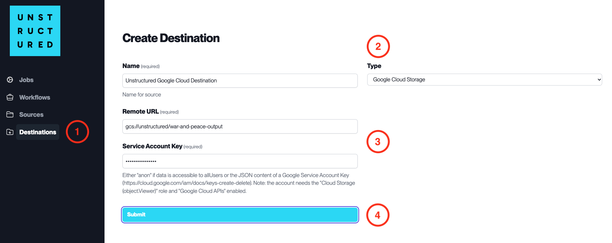

Google Cloud Storage
====================

This page contains the information to store processed data to Google Cloud Storage.

Prerequisites
--------------

- Google Cloud Storage Bucket URL
- Service Account Key for Google Cloud Storage

For more information, please refer to `Google Cloud Storage documentation <https://cloud.google.com/storage/docs>`__.

Step-by-Step Guide
-------------------

1. **Access the Create Destination Page**. Navigate to the "Destinations" section within the platform's side navigation menu and click on "New Destination" to initiate the setup of a new destination for your processed data.

2. **Select Destination Type**. Select **Google Cloud Storage** destination connector from the ``Type`` dropdown menu.

3. **Configure Destination Details**

  - ``Name`` (*required*): Assign a descriptive name to the new destination connector.
  - ``Remote URL`` (*required*): Enter the Google Cloud Storage bucket URL where the data will be stored.
  - ``Service Account Key`` (*required*): Provide the Service Account Key that has been granted access to the specified Google Cloud Storage bucket.

    - Note: the ``Service Account Key`` must have the **Storage Object Creator** role at minimum to ensure proper access permissions. Please refer to `GCS IAM documentation `here <https://cloud.google.com/storage/docs/access-control/iam>`__.

4. **Submit**. Review all the details entered to ensure accuracy. Click 'Submit' to finalize the creation of the Destination Connector. The newly completed Google Cloud Storage connector will be listed on the Destinations dashboard.
