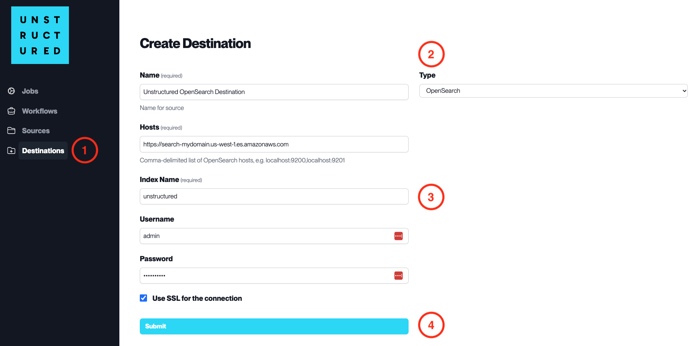

OpenSearch
==========

This page contains the information to store processed data to an OpenSearch cluster.

Prerequisites
--------------

- OpenSearch Hosts
- Index Name
- Username and Password (if required)
- SSL configuration (if required)

For more information, please refer to `OpenSearch documentation <https://opensearch.org/docs/latest/>`__.

.. warning::
    Ensure that the index schema is compatible with the data you intend to write.
    If you need guidance on structuring your schema, consult the `Vector Search Sample Mapping  <https://unstructured-io.github.io/unstructured/ingest/destination_connectors/opensearch.html#vector-search-sample-mapping>`__ for reference.

Step-by-Step Guide
-------------------

1. **Access the Create Destination Page**. Navigate to the "Destinations" section within the platform's side navigation menu and click on "New Destination" to initiate the setup of a new destination for your processed data.

2. **Select Destination Type**. Select **OpenSearch** destination connector from the ``Type`` dropdown menu.

3. **Configure Destination Details**

  - ``Name`` (*required*): Assign a descriptive name to the new destination connector.
  - ``Hosts`` (*required*): Enter the comma-delimited list of OpenSearch hosts.
  - ``Index Name`` (*required*): Provide the name of the index where the data will be stored.
  - ``Username``: Input the username for the OpenSearch cluster if authentication is enabled.
  - ``Password``: Enter the password associated with the username.
  - Check ``Use SSL for the connection`` if the OpenSearch cluster requires an SSL connection for security purposes.

4. **Submit**. Review all the details entered to ensure accuracy. Click 'Submit' to finalize the creation of the Destination Connector. The newly completed OpenSearch connector will be listed on the Destinations dashboard.
