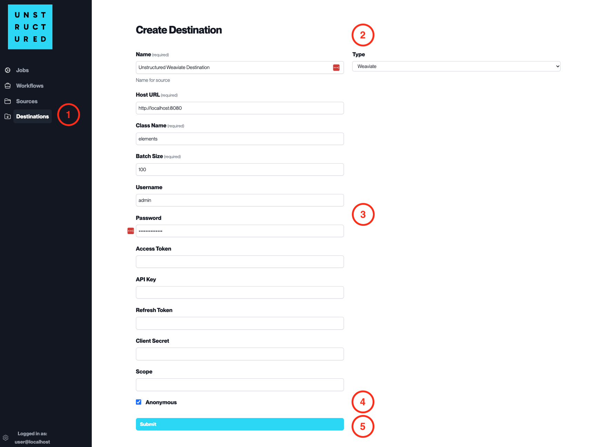

Weaviate
========

This page contains the information to store processed data to Weaviate.

Prerequisites
--------------

- Weaviate Local Install or Cloud Service
- Weaviate URL and Class Name
- Authentication Credentials (if required)

For more information, please refer to `Weaviate documentation <https://weaviate.io/developers/weaviate/current/>`__.

.. warning::
    Ensure that the index schema is compatible with the data you intend to write.
    If you need guidance on structuring your schema, consult the `Sample Index Schema <https://unstructured-io.github.io/unstructured/ingest/destination_connectors/weaviate.html#sample-index-schema>`__ for reference.

Step-by-Step Guide
-------------------

1. **Access the Create Destination Page**. Navigate to the "Destinations" section within the platform's side navigation menu and click on "New Destination" to initiate the setup of a new destination for your processed data.

2. **Select Destination Type**. Select **Weaviate** destination connector from the ``Type`` dropdown menu.

3. **Configure Destination Details**

  - ``Name`` (*required*): Assign a descriptive name to the new destination connector.
  - ``Host URL`` (*required*): Enter the URL of the Weaviate instance.
  - ``Class Name`` (*required*): Specify the class name within Weaviate where data will be stored.
  - ``Batch Size`` (*required*): Define the number of records the platform will send in a single batch.
  - ``Username``: Provide the username if authentication is required.
  - ``Password``: Enter the password corresponding to the username.
  - ``Access Token``, ``API Key``, ``Refresh Token``, ``Client Secret``: Provide these details if needed for the Weaviate authentication process.
  - ``Scope``: Specify the scope if applicable for OAuth.

4. **Additional Settings**

  - Check ``Anonymous`` if you are connecting without authentication.

5. **Submit**. Review all the details entered to ensure accuracy. Click 'Submit' to finalize the creation of the Destination Connector. The newly completed Weaviate connector will be listed on the Destinations dashboard.
