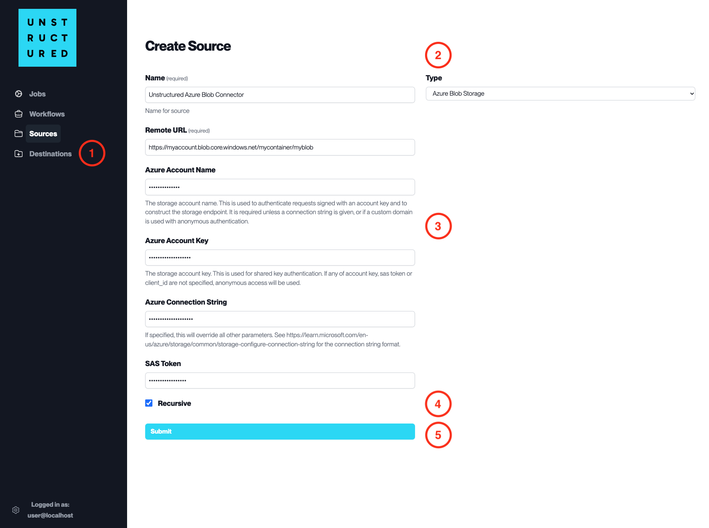

Azure Blob Storage
==================

This page contains the information to ingest your documents from Azure Blob Storage.

Prerequisites
--------------

- Azure Account
- Azure Blob Storage Container

For more information, please refer to `Azure Blob Storage documentation <https://docs.microsoft.com/en-us/azure/storage/blobs/storage-blobs-introduction>`__.

Step-by-Step Guide
-------------------

1. **Access the Create Source Page**. Navigate to the "Sources" section on the left sidebar and click the "New Source" button.

2. **Select Source Type**. Select **Azure Blob Storage** from the ``Type`` dropdown menu.

3. **Configure Source Details to connect to Azure Blob Storage**

  - ``Name`` (*required*): Enter a unique name for the source connector.
  - ``Remote URL`` (*required*): Enter the URL that points to the Azure Blob Storage container.
  - ``Azure Account Name`` (*required*): Provide the name of your Azure storage account.
  - ``Azure Account Key``: Enter your Azure storage account key for authentication.
  - ``Azure Connection String``: If applicable, provide the Azure connection string that overrides all other connection parameters.
  - ``SAS Token``: If using a shared access signature for authentication, provide the SAS token here.

4. **Additional Settings**

  - Check ``Recursive`` if you want the platform to recursively ingest data from sub-folders within the container.

5. **Submit**. After filling in the necessary information, click 'Submit' to create the Source Connector. The newly completed connector will be listed on the Sources dashboard.
