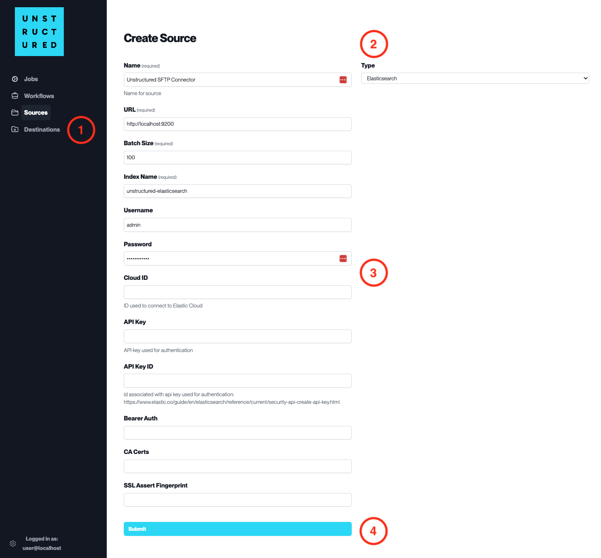

Elasticsearch
=============

This page contains the information to ingest your data from Elasticsearch.

Prerequisites
--------------

- Elasticsearch Local Install or Cloud Service
- Index Name
- Username and Password for Elasticsearch access (if required)
- Cloud ID (if using Elastic Cloud)
- API Key and API Key ID for authentication (if required)

For more information, please refer to `Elasticsearch documentation <https://www.elastic.co/guide/en/elasticsearch/reference/current/index.html>`__.

Step-by-Step Guide
-------------------

1. **Access the Create Source Page**. Navigate to the "Sources" section on the left sidebar and click the "New Source" button.

2. **Select Source Type**. Select **Elasticsearch** from the ``Type`` dropdown menu.

3. **Configure Source Details to connect to Elasticsearch**

  - ``Name`` (*required*): Enter a unique name for the Elasticsearch source connector.
  - ``URL`` (*required*): Specify the Elasticsearch cluster URL.
  - ``Batch Size`` (*required*): Set the number of records the platform will process in a single batch.
  - ``Index Name`` (*required*): Provide the name of the index in the Elasticsearch cluster.
  - ``Username``: Input the username for the Elasticsearch cluster if authentication is enabled.
  - ``Password``: Enter the password associated with the username for the Elasticsearch cluster.
  - ``Cloud ID``: If using Elastic Cloud, specify the Cloud ID.
  - ``API Key``: Provide the API Key for authentication if this method is used.
  - ``API Key ID``: Enter the ID associated with the API Key if needed.
  - ``Bearer Auth``: Specify if bearer authentication is used (leave blank if not applicable).
  - ``CA Certs``: Include the CA Certificates for SSL connection if required.
  - ``SSL Assert Fingerprint``: Provide the SSL fingerprint for secure connection if necessary.

4. **Submit**. After filling in the necessary information, click 'Submit' to create the Source Connector. The newly completed Elasticsearch connector will be listed on the Sources dashboard.
