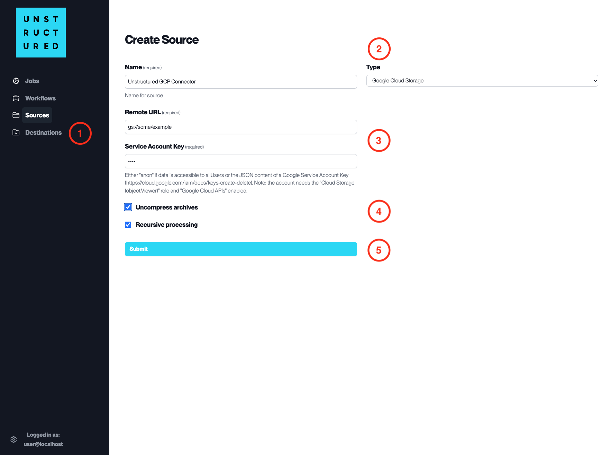

Google Cloud Storage
====================

This page contains the information to ingest your data from Google Cloud Storage.

Prerequisites
--------------

- Google Cloud Storage Bucket URL
- Service Account Key for Google Cloud Storage

For more information, please refer to `Google Cloud Storage documentation <https://cloud.google.com/storage/docs>`__.

Step-by-Step Guide
-------------------

1. **Access the Create Source Page**. Navigate to the "Sources" section on the left sidebar and click the "New Source" button.

2. **Select Source Type**. Select **Google Cloud Storage** from the ``Type`` dropdown menu.

3. **Configure Source Details to connect to Google Cloud Storage**

  - ``Name`` (*required*): Enter a unique name for the Google Cloud Storage source connector.
  - ``Remote URL`` (*required*): Specify the gs:// URL pointing to your Google Cloud Storage bucket and path.
  - ``Service Account Key`` (*required*): Enter the JSON content of a Google Service Account Key that has the necessary permissions to access the specified bucket.

4. **Additional Settings**

  - Check ``Uncompress archives`` if the data to be ingested is compressed and requires uncompression.
  - Check ``Recursive processing`` if you want the platform to ingest data recursively from sub-folders within the bucket.

5. **Submit**. After filling in the necessary information, click 'Submit' to create the Source Connector. The newly completed Google Cloud Storage connector will be listed on the Sources dashboard.
