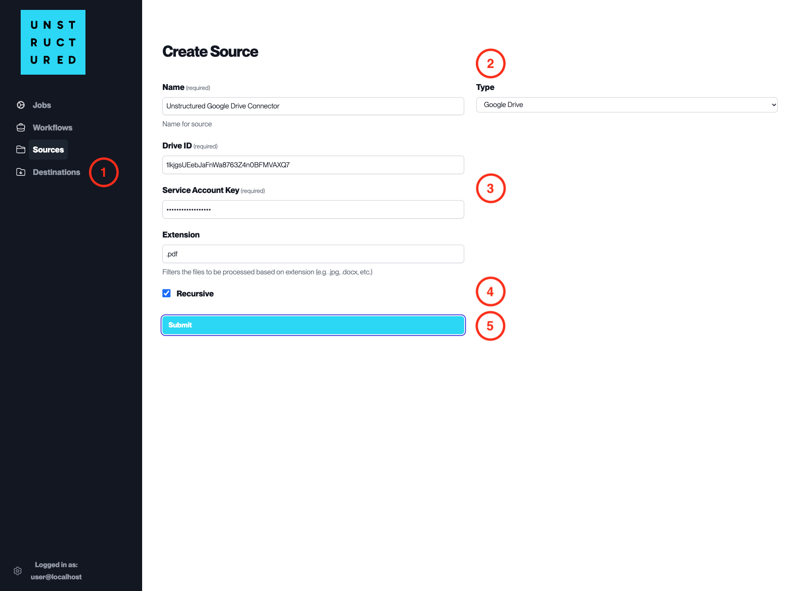

Google Drive
============

This page contains the information to ingest your data from Google Drive.

Prerequisites
--------------

- Google Account
- Google Drive Folders and Files
- Service Account Key with permissions to access the Google Drive

For more information, please refer to `Google Drive API documentation <https://developers.google.com/drive/api/v3/about-sdk>`__.

Step-by-Step Guide
-------------------

1. **Access the Create Source Page**. Navigate to the "Sources" section on the left sidebar and click the "New Source" button.

2. **Select Source Type**. Select **Google Drive** from the ``Type`` dropdown menu.

3. **Configure Source Details to connect to Google Drive**

  - ``Name`` (*required*): Enter a unique name for the Google Drive source connector.
  - ``Drive ID`` (*required*): Input the Drive ID associated with the Google Drive you wish to connect.
  - ``Service Account Key`` (*required*): Provide the Service Account Key that has been granted access to the specified Google Drive.
  - ``Extension``: Specify the file extensions to be included in the ingestion process, if filtering is required.

4. **Additional Settings**

  - Check ``Recursive`` if you want the platform to recursively ingest files from sub-folders within the specified Google Drive.

5. **Submit**. After filling in the necessary information, click 'Submit' to create the Source Connector. The newly completed Google Drive connector will be listed on the Sources dashboard.
