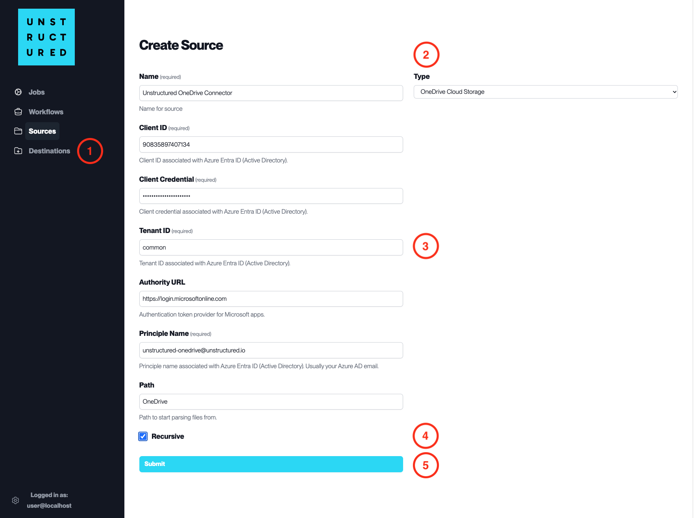

OneDrive Cloud Storage
======================

This page contains the information to ingest your data from OneDrive.

Prerequisites
--------------

- Microsoft OneDrive Account
- Client ID and Client Credential with Azure AD
- Tenant ID for Azure AD
- Principle Name (usually Azure AD email)
- Path to the OneDrive folder to ingest from

For more information, please refer to `OneDrive API documentation <https://docs.microsoft.com/en-us/onedrive/developer/rest-api/>`__.

Step-by-Step Guide
-------------------

1. **Access the Create Source Page**. Navigate to the "Sources" section on the left sidebar and click the "New Source" button.

2. **Select Source Type**. Select **OneDrive Cloud Storage** from the ``Type`` dropdown menu.

3. **Configure Source Details to connect to OneDrive**

  - ``Name`` (*required*): Enter a unique name for the OneDrive source connector.
  - ``Client ID`` (*required*): Input the Client ID associated with Azure AD.
  - ``Client Credential`` (*required*): Enter the Client Credential associated with the Client ID.
  - ``Tenant ID`` (*required*): Specify the Tenant ID associated with Azure AD.
  - ``Authority URL``: Provide the URL for the authentication token provider for Microsoft apps.
  - ``Principle Name`` (*required*): Input the Principle Name associated with Azure AD, usually your Azure AD email.
  - ``Path``: Specify the path within OneDrive from which to start parsing files.

4. **Additional Settings**

  - Check ``Recursive`` if you want the platform to recursively ingest files from sub-folders within the specified OneDrive path.

5. **Submit**. After filling in the necessary information, click 'Submit' to create the Source Connector. The newly completed OneDrive connector will be listed on the Sources dashboard.

