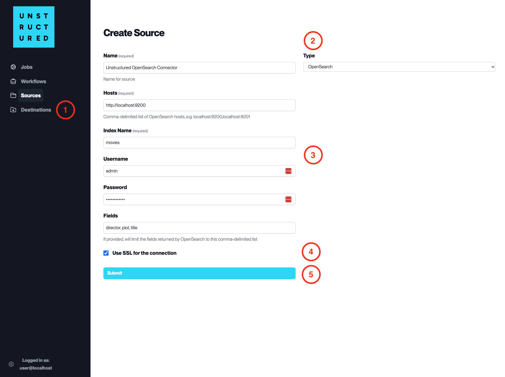

OpenSearch
==========

This page contains the information to ingest your data from OpenSearch.

Prerequisites
--------------

- OpenSearch Hosts
- Index Name
- Username and Password (if required)
- SSL configuration (if required)

For more information, please refer to `OpenSearch documentation <https://opensearch.org/docs/latest/>`__.

Step-by-Step Guide
-------------------

1. **Access the Create Source Page**. Navigate to the "Sources" section on the left sidebar and click the "New Source" button.

2. **Select Source Type**. Select **OpenSearch** from the ``Type`` dropdown menu.

3. **Configure Source Details to connect to OpenSearch**

  - ``Name`` (*required*): Enter a unique name for the OpenSearch source connector.
  - ``Hosts`` (*required*): Specify the OpenSearch cluster hosts, including the protocol and port, separated by commas.
  - ``Index Name`` (*required*): Provide the name of the index from which to start ingesting data.
  - ``Username``: Input the username for the OpenSearch cluster if authentication is enabled.
  - ``Password``: Enter the password associated with the username for the OpenSearch cluster.
  - ``Fields``: List the specific fields to be ingested from the OpenSearch index, separated by commas.

4. **Additional Settings**

  - Check ``Use SSL for the connection`` if the OpenSearch cluster requires an SSL connection for security purposes.

5. **Submit**. After filling in the necessary information, click 'Submit' to create the Source Connector. The newly completed OpenSearch connector will be listed on the Sources dashboard.
