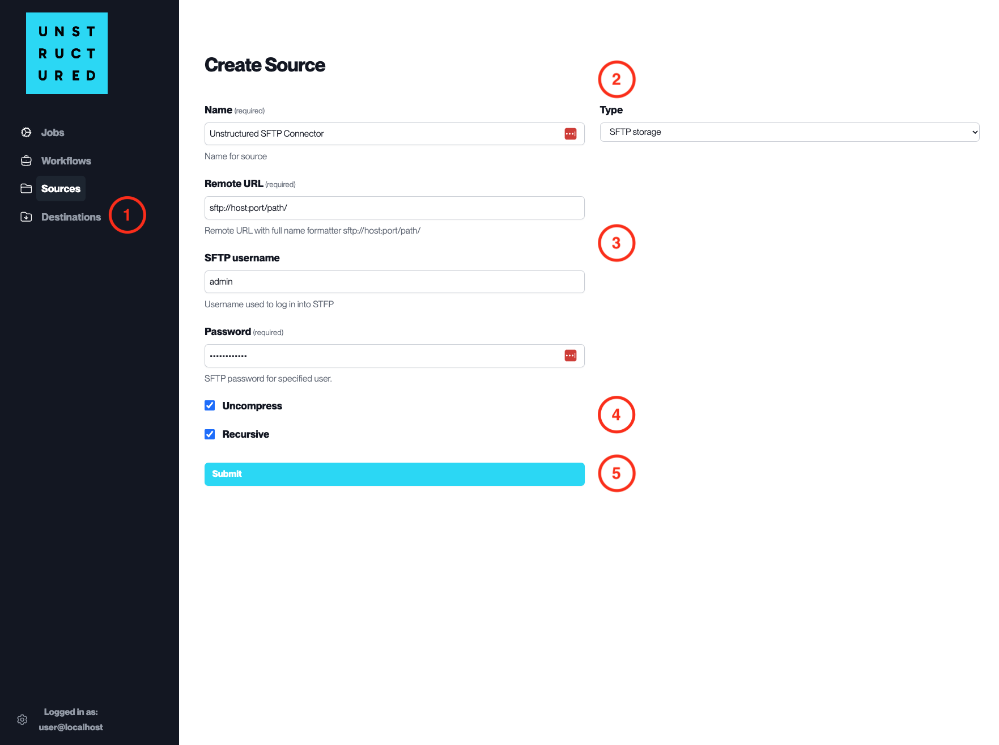

SFTP Storage
============

This page contains the information to ingest your data from an SFTP server.

Prerequisites
--------------

- SFTP server URL, Username and Password
- Directory path to start the data ingestion from

For more information, please refer to `SFTP documentation <https://en.wikipedia.org/wiki/SSH_File_Transfer_Protocol>`__.

Step-by-Step Guide
-------------------

1. **Access the Create Source Page**. Navigate to the "Sources" section on the left sidebar and click the "New Source" button.

2. **Select Source Type**. Select **SFTP Storage** from the ``Type`` dropdown menu.

3. **Configure Source Details to connect to SFTP**

  - ``Name`` (*required*): Enter a unique name for the SFTP source connector.
  - ``Remote URL`` (*required*): Specify the SFTP server URL with the full path (e.g., sftp://host:port/path/).
  - ``SFTP username``: Input the username for logging into the SFTP server.
  - ``Password`` (*required*): Enter the password associated with the SFTP username.

4. **Additional Settings**

  - Check ``Uncompress`` if the files to be ingested are compressed and require decompression.
  - Check ``Recursive`` if you want the platform to recursively ingest files from subdirectories.

5. **Submit**. After filling in the necessary information, click 'Submit' to create the Source Connector. The newly completed SFTP connector will be listed on the Sources dashboard.
