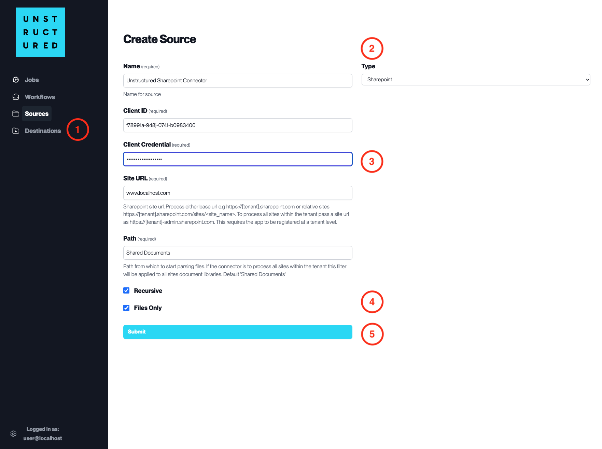

Sharepoint
==========

This page contains the information to ingest your documents from Sharepoint sites.

Prerequisites
--------------

- Sharepoint Site URL
- Client ID and Client Credential with access to the Sharepoint instance

For more information, please refer to `Sharepoint Online documentation <https://docs.microsoft.com/en-us/sharepoint/dev/>`__.

Step-by-Step Guide
-------------------

1. **Access the Create Source Page**. Navigate to the "Sources" section on the left sidebar and click the "New Source" button.

2. **Select Source Type**. Select **Sharepoint** from the ``Type`` dropdown menu.

3. **Configure Source Details to connect to Sharepoint**

  - ``Name`` (*required*): Enter a unique name for the Sharepoint source connector.
  - ``Client ID`` (*required*): Input the Client ID provided by Sharepoint for app registration.
  - ``Client Credential`` (*required*): Enter the Client Credential (secret or certificate) associated with the Client ID.
  - ``Site URL`` (*required*): Provide the base URL of the Sharepoint site you wish to connect to.
  - ``Path`` (*required*): Specify the path from which to start parsing files. Default is "Shared Documents".

4. **Additional Settings**

  - Check ``Recursive`` if you want the platform to recursively ingest data from sub-folders within the specified path.
  - Check ``Files Only`` if you want the platform to ingest files without considering the folder structure.

5. **Submit**. After filling in the necessary information, click 'Submit' to create the Source Connector. The newly completed Sharepoint connector will be listed on the Sources dashboard.
