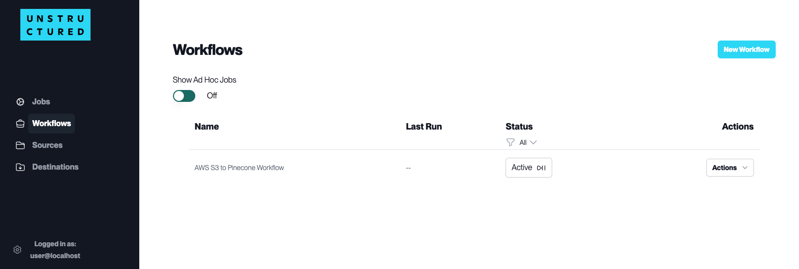
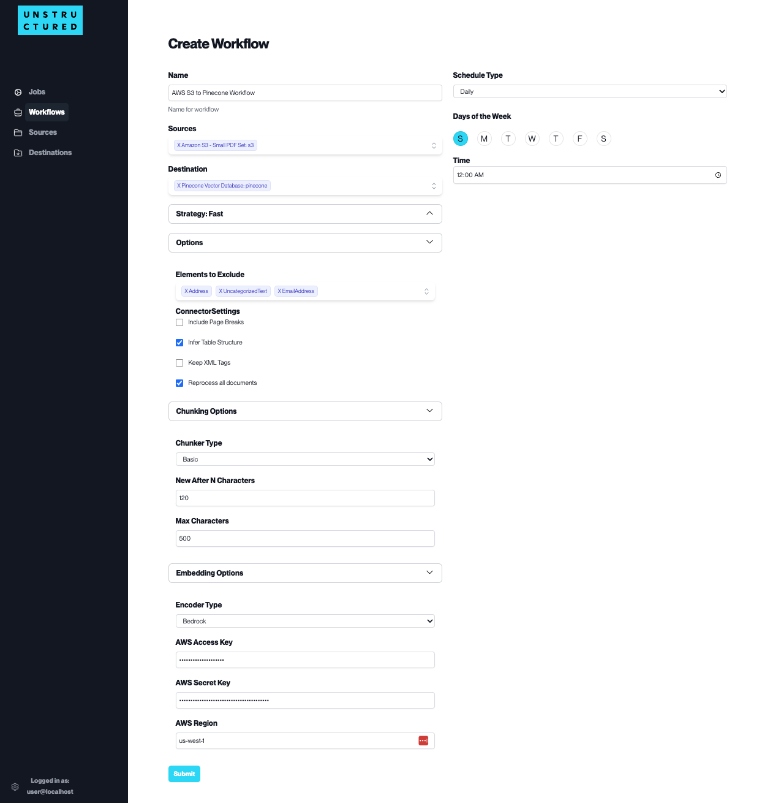
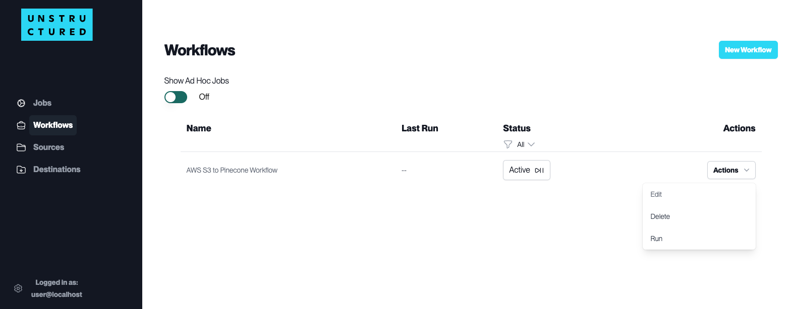
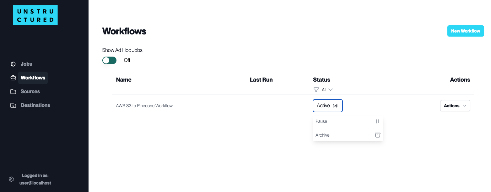

Workflow Dashboard
==================

A Workflow in the Unstructured Platform is a defined sequence of processes that automate the data handling from source to destination. It allows users to configure how and when data should be ingested, processed, and stored.

Workflows are crucial for establishing a systematic approach to managing data flows within the platform, ensuring consistency, efficiency, and adherence to specific data processing requirements.

.. note::
    The "Show Ad Hoc Jobs" switch views or hides one-time jobs that do not repeat on a schedule.

Set up A Workflow Automation
----------------------------

The key components of a Workflow include:

- **Name**: Assign a unique identifier to the workflow for easy recognition and management.

- **Schedule Type**: Determine how frequently the workflow should run. While scheduling is available for regular automated execution daily or weekly, workflows can also be triggered on a one-off basis as needed.

- **Sources and Destination**: Select the data's origin (Source Connectors) and endpoint (Destination Connectors) for the workflow. You can also configure multiple Source Connectors to aggregate data from various origins. Furthermore, you can also configure multiple Destination Connectors to replicate the processed data in various locations.

- **Strategy**: Choose a data processing strategy. See the alternative strategies you can use in the following section.

- **Options**: Tailor the workflow further with options to exclude certain elements, adjust connector settings (including page breaks or retaining XML tags), and decide whether to reprocess all documents. See the explanation of these options in the following section.

- **Chunking and Embedding Options**: Fine-tune how the data is segmented ('Chunker Type') and select the type of data encoding ('Encoder Type') if necessary. See the explanation of these options in the following section.

**Options to Fine-Tune Data Processing in the Workflows**

- **Strategy**: Choose a data processing strategy. The available options are:

  - ``auto`` (default strategy): The “auto” strategy will choose the partitioning strategy based on document characteristics and the function kwargs.
  - ``fast``: The “fast” strategy will leverage traditional NLP extraction techniques to pull all text elements quickly. The “fast” strategy is not good for image-based file types.
  - ``hi_res``: The “hi_res” strategy will identify the document's layout using detectron2. The advantage of “hi_res” is that it uses the document layout to gain additional information about document elements. We recommend using this strategy if your use case is highly sensitive to correct classifications for document elements.
  - ``ocr_only``: Leverage Optical Character Recognition to extract text from the image-based files.

- **Options**: Tailor the workflow further with the following options

  - ``Elements to Exclude``: Select the `element types <https://unstructured-io.github.io/unstructured/introduction/overview.html#id1>`__ you want to exclude from document processing. This option is useful if you want to include or exclude elements, such as Table or Image elements.

  - Connector Settings:

    - ``Include Page Breaks``: If checked, the output will include page breaks if the file type supports it. For more information about page break, check out the documentation `here <https://unstructured-io.github.io/unstructured/apis/api_parameters.html#include-page-breaks>`__.

    - ``Infer Table Structure``: Check if you want to extract tables from PDFs or images.

    - ``Keep XML Tags``: If checked, the output will retain the XML tags. This only applies to partition_xml. For more information about XML tags, check out the documentation `here <https://unstructured-io.github.io/unstructured/apis/api_parameters.html#xml-keep-tags>`__.

    - ``Reprocess all documents``: The workflow will process the previously processed documents if checked.

- **Chunking Options**: To turn chunking the processed data on or off. When turned on, users can select one of the two chunking strategies:

  - ``Chunk by Title``: When a "Title" element appears, it marks the start of a new section. The system will then finish the current chunk and begin a new one, even if the current chunk has space to include the "Title" element. For more information about chunk by title, please refer to the documentation `here <https://unstructured-io.github.io/unstructured/core/chunking.html#by-title-chunking-strategy>`__.

  - ``Basic``: This strategy combines the sequential elements to optimize the size of each chunk while adhering to the predefined "max_characters" (hard maximum) and "new_after_n_chars" (soft maximum) settings. For more information about basic chunking, please refer to the documentation `here <https://unstructured-io.github.io/unstructured/core/chunking.html#basic-chunking-strategy>`__.

- **Embedding Options**: To turn on or off vectorizing the processed data. When turned on, users can select one of these two embedding models:

  - ``OpenAI``: enter the *API Key* and select the model name from the dropdown menu. For more information about OpenAI embedding, please refer to the documentation `here <https://unstructured-io.github.io/unstructured/core/embedding.html#openaiembeddingencoder>`__.

  - ``Bedrock``: enter the *AWS Access Key*, *AWS Secret Key*, and *AWS Region* to connect to AWS Bedrock embedding models. For more information about AWS Bedrock embedding, please refer to the documentation `here <https://unstructured-io.github.io/unstructured/core/embedding.html#bedrockembeddingencoder>`__.

Managing Workflow Actions
--------------------------

For each of the workflows on the Workflow list page, the following actions are available under the ``Actions`` dropdown menu next to the respective workflow name:

- **Edit**: Modify the existing configuration of your workflow. This can include changing the source, destination, scheduling, and chunking strategies, among other settings.

- **Delete**: Remove the workflow from the platform. Use this action cautiously, as it will permanently delete the workflow and its configurations.

- **Run**: Manually initiate the workflow outside of its scheduled runs. This is particularly useful for testing or ad-hoc data processing needs.

Monitoring Workflow Status
---------------------------

The status of the workflows is a quick visual indicator of their current state on the Workflows list page. The status of your workflows can be one of the following three states:

- **Active**: An 'Active' status means the workflow is enabled and will run as scheduled. It is ready to process data according to its configuration.

- **Pause**: If you need to temporarily halt the workflow without altering its configuration, you can pause it. This is useful when the source data is undergoing maintenance, or you're implementing changes that may affect the workflow's operation.

- **Archive**: Workflows that are no longer in use but need to be kept for record-keeping or compliance purposes can be archived. This status removes the workflow from active duty without deleting its setup.

