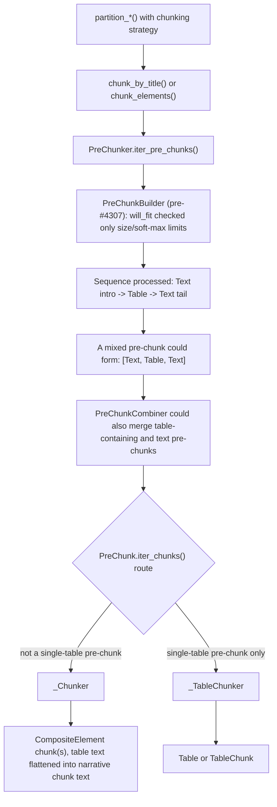
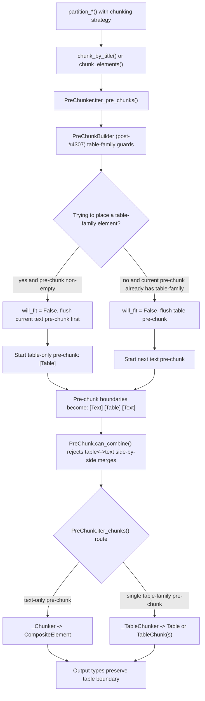

# Table Isolation Flow Before and After #4307

This note captures how chunking flow changed when table-family isolation moved earlier in the
pipeline in PR #4307.

Scenario used in both diagrams:

- Input element order: `NarrativeText("intro text")`, `Table(...)`, `NarrativeText("tail text")`.
- Shared call path: `partition_*()` -> `chunk_by_title()` or `chunk_elements()` ->
  `PreChunker.iter_pre_chunks()` -> `PreChunk.iter_chunks()`.

## Before #4307 (table leakage possible)

## After #4307 (early table-family isolation)

## Command-backed observed output types

| Revision | `chunk_elements([Text, Table, Text])` types | `partition_html(..., chunking_strategy=\"by_title\")` types |
| --- | --- | --- |
| pre-#4307 base (`47f4728`) | `["CompositeElement"]` | `["CompositeElement"]` |
| post-#4307 fix (`547d3c8`) | `["CompositeElement", "Table", "CompositeElement"]` | `["CompositeElement", "Table", "CompositeElement"]` |

Code touchpoints for this behavior are in `unstructured/chunking/base.py`:
`PreChunkBuilder.will_fit()` and `PreChunk.can_combine()`.
