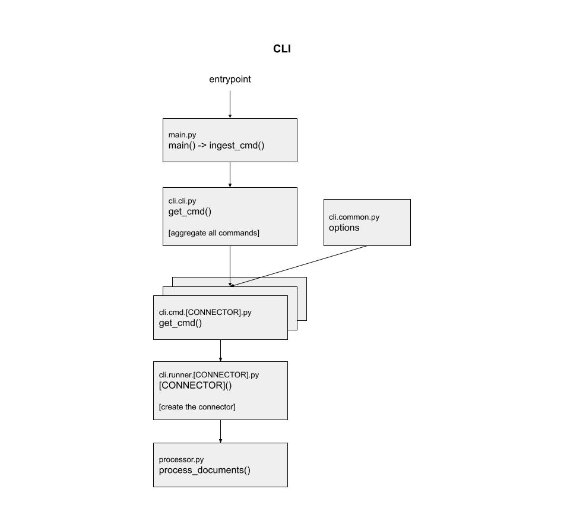
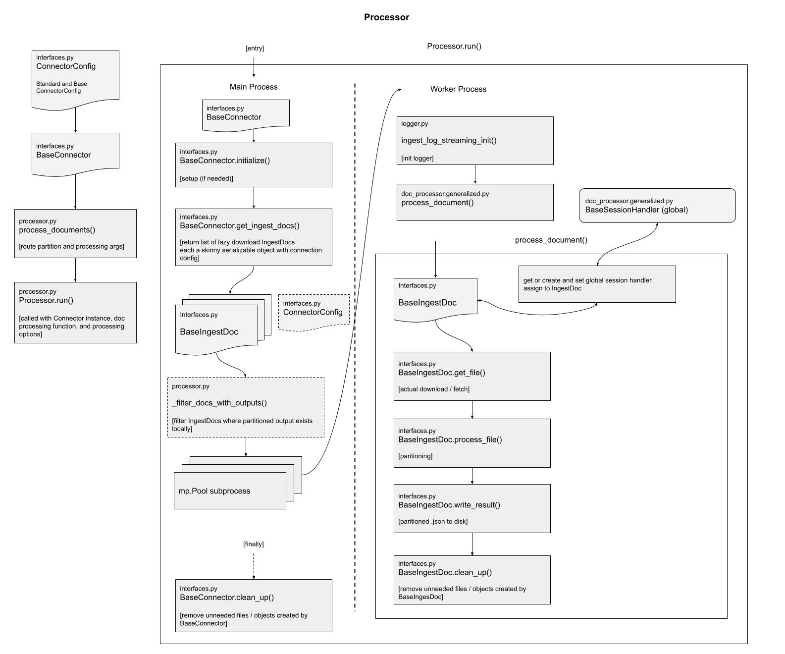

# Batch Processing Documents

## The unstructured-ingest CLI

The unstructured library includes a CLI to batch ingest documents from various sources, storing structured outputs locally on the filesystem.

For example, the following command processes all the documents in S3 in the
`utic-dev-tech-fixtures` bucket with a prefix of `small-pdf-set/`.

    unstructured-ingest \
       s3 \
       --remote-url s3://utic-dev-tech-fixtures/small-pdf-set/ \
       --anonymous \
       --structured-output-dir s3-small-batch-output \
       --num-processes 2

Naturally, --num-processes may be adjusted for better instance utilization with multiprocessing.

Installation note: make sure to install the following extras when installing unstructured, needed for the above command:

    pip install "unstructured[s3,local-inference]"

See the [Quick Start](https://github.com/Unstructured-IO/unstructured#eight_pointed_black_star-quick-start) which documents how to pip install `dectectron2` and other OS dependencies, necessary for the parsing of .PDF files.

# Developers' Guide

## Local testing

When testing from a local checkout rather than a pip-installed version of `unstructured`,
just execute `unstructured/ingest/main.py`, e.g.:

    PYTHONPATH=. ./unstructured/ingest/main.py \
       s3 \
       --remote-url s3://utic-dev-tech-fixtures/small-pdf-set/ \
       --anonymous \
       --structured-output-dir s3-small-batch-output \
       --num-processes 2

## Adding Data Connectors

To add a connector, refer to [unstructured/ingest/connector/github.py](unstructured/ingest/connector/github.py) as example that implements the three relevant abstract base classes.

If the connector has an available `fsspec` implementation, then refer to [unstructured/ingest/connector/s3.py](unstructured/ingest/connector/s3.py).

Then, update [unstructured/ingest/main.py/cli](unstructured/ingest/cli) to add a subcommand associated with the connector, and hook it up to the parent group.

Create at least one folder [examples/ingest](examples/ingest) with an easily reproducible
script that shows the new connector in action.

Finally, to ensure the connector remains stable, add a new script test_unstructured_ingest/test-ingest-\<the-new-data-source\>.sh similar to [test_unstructured_ingest/test-ingest-s3.sh](test_unstructured_ingest/test-ingest-s3.sh), and append a line invoking the new script in [test_unstructured_ingest/test-ingest.sh](test_unstructured_ingest/test-ingest.sh).

You'll notice that the unstructured outputs for the new documents are expected
to be checked into CI under test_unstructured_ingest/expected-structured-output/\<folder-name-relevant-to-your-dataset\>. So, you'll need to `git add` those json outputs so that `test-ingest.sh` passes in CI.

The `main.py` flags of --re-download/--no-re-download , --download-dir, --preserve-downloads, --structured-output-dir, and --reprocess are honored by the connector.

### The checklist:

In checklist form, the above steps are summarized as:

- [ ] Create a new module under [unstructured/ingest/connector/](unstructured/ingest/connector/) implementing the 3 abstract base classes, similar to [unstructured/ingest/connector/github.py](unstructured/ingest/connector/github.py).
  - [ ] The subclass of `BaseIngestDoc` overrides `process_file()` if extra processing logic is needed other than what is provided by [auto.partition()](unstructured/partition/auto.py).
- [ ] Update [unstructured/ingest/cli](unstructured/ingest/cli) with support for the new connector.
- [ ] Create a folder under [examples/ingest](examples/ingest) that includes at least one well documented script.
- [ ] Add a script test_unstructured_ingest/test-ingest-\<the-new-data-source\>.sh. It's json output files should have a total of no more than 100K.
- [ ] Git add the expected outputs under test_unstructured_ingest/expected-structured-output/\<folder-name-relevant-to-your-dataset\> so the above test passes in CI.
- [ ] Add a line to [test_unstructured_ingest/test-ingest.sh](test_unstructured_ingest/test-ingest.sh) invoking the new test script.
- [ ] If additional python dependencies are needed for the new connector:
  - [ ] Add them as an extra to [setup.py](unstructured/setup.py).
  - [ ] Update the Makefile, adding a target for `install-ingest-<name>` and adding another `pip-compile` line to the `pip-compile` make target. See [this commit](https://github.com/Unstructured-IO/unstructured/commit/ab542ca3c6274f96b431142262d47d727f309e37) for a reference.
  - [ ] The added dependencies should be imported at runtime when the new connector is invoked, rather than as top-level imports.
  - [ ] Add the decorator `unstructured.utils.requires_dependencies` on top of each class instance or function that uses those connector-specific dependencies e.g. for `GitHubConnector` should look like `@requires_dependencies(dependencies=["github"], extras="github")`
  - [ ] Run `make tidy` and `make check` to ensure linting checks pass.
- [ ] Honors the conventions of `BaseConnectorConfig` defined in [unstructured/ingest/interfaces.py](unstructured/ingest/interfaces.py) which is passed through [the CLI](unstructured/ingest/main.py):
  - [ ] If running with an `.output_dir` where structured outputs already exists for a given file, the file content is not re-downloaded from the data source nor is it reprocessed. This is made possible by implementing the call to `MyIngestDoc.has_output()` which is invoked in [MainProcess._filter_docs_with_outputs](ingest-prep-for-many/unstructured/ingest/main.py).
  - [ ] Unless `.reprocess` is `True`, then documents are always reprocessed.
  - [ ] If `.preserve_download` is `True`, documents downloaded to `.download_dir` are not removed after processing.
  - [ ] Else if `.preserve_download` is `False`, documents downloaded to `.download_dir` are removed after they are **successfully** processed during the invocation of `MyIngestDoc.cleanup_file()` in [process_document](unstructured/ingest/doc_processor/generalized.py)
  - [ ] Does not re-download documents to `.download_dir` if `.re_download` is False, enforced in `MyIngestDoc.get_file()`
  - [ ] Prints more details if `--verbose` in ingest CLI, similar to [unstructured/ingest/connector/github.py](unstructured/ingest/connector/github.py) logging messages.

## Design References

`unstructured/ingest/main.py` is the entrypoint for the `unstructured-ingest` cli. It calls the cli Command as fetched from `cli.py` `get_cmd()`.

`get_cmd()` aggregates all subcommands (one per connector) as defined in the cli.cmd module. Each of these per-connector commands define the connector specific options and import the relevant common options. They call out to the corollary cli.runner.[CONNECTOR].py module.

The runner is a vanilla (not Click wrapped) Python function which also explicitly exposes the connector specific arguments. It instantiates the connector with aggregated options / configs and passes it in call to `process_documents()` in `processor.py`.

Given an instance of BaseConnector with a reference to its ConnectorConfig (BaseConnectorConfig and StandardConnectorConfig) and set of processing parameters, `process_documents()` instantiates the Processor class and calls its `run()` method.

The Processor class (operating in the Main Process) calls to the connector to fetch `get_ingest_docs()`, a list of lazy download IngestDocs, each a skinny serializable object with connection config. These IngestDocs are filtered (where output results already exist locally) and passed to a multiprocessing Pool. Each subprocess in the pool then operates as a Worker Process. The Worker Process first initializes a logger, since it is operating in its own spawn of the Python interpreter. It then calls the `process_document()` function in `doc_processor.generalized.py`. 

The `process_document()` function is given an IngestDoc, which has a reference to the respective ConnectorConfigs. Also defined is a global session_handler (of type BaseSessionHandler). This contains any session/connection relevant data for the IngestDoc that can be re-used when processing sibling IngestDocs from the same BaseConnector / config. If the value for the session_handle isn't assigned, a session_handle is created from the IngestDoc and assigned to the global variable, otherwise the existing global variable value ("session") is leveraged to process the IngestDoc. The function proceeds to call the IngestDoc's `get_file()`, `process_file()`, `write_result()`, and `clean_up()` methods.

Once all multiprocessing subprocesses complete a final call to the BaseConnector `clean_up()` method is made.

