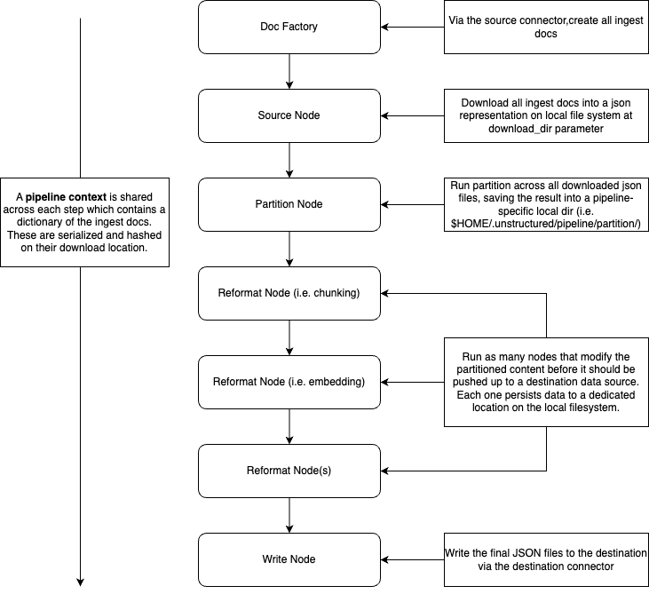

# Batch Processing Documents

## The unstructured-ingest CLI

The unstructured library includes a CLI to batch ingest documents from various sources, storing structured outputs locally on the filesystem.

For example, the following command processes all the documents in S3 in the
`utic-dev-tech-fixtures` bucket with a prefix of `small-pdf-set/`.

    unstructured-ingest \
       s3 \
       --remote-url s3://utic-dev-tech-fixtures/small-pdf-set/ \
       --anonymous \
       --output-dir s3-small-batch-output \
       --num-processes 2

Naturally, --num-processes may be adjusted for better instance utilization with multiprocessing.

Installation note: make sure to install the following extras when installing unstructured, needed for the above command:

    pip install "unstructured[s3,local-inference]"

See the [Quick Start](https://github.com/Unstructured-IO/unstructured#eight_pointed_black_star-quick-start) which documents how to pip install `dectectron2` and other OS dependencies, necessary for the parsing of .PDF files.

# Developers' Guide

## Local testing

When testing from a local checkout rather than a pip-installed version of `unstructured`,
just execute `unstructured/ingest/main.py`, e.g.:

    PYTHONPATH=. ./unstructured/ingest/main.py \
       s3 \
       --remote-url s3://utic-dev-tech-fixtures/small-pdf-set/ \
       --anonymous \
       --output-dir s3-small-batch-output \
       --num-processes 2

## Adding Source Data Connectors

To add a connector, refer to [unstructured/ingest/connector/github.py](unstructured/ingest/connector/github.py) as an example that implements the three relevant abstract base classes.

If the connector has an available `fsspec` implementation, then refer to [unstructured/ingest/connector/s3.py](unstructured/ingest/connector/s3.py).

Then, update [unstructured/ingest/main.py/cli](unstructured/ingest/cli) to add a subcommand associated with the connector, and hook it up to the parent group.

Add an implementation of `BaseRunner` in the runner directory to connect the invocation of the CLI with the underlying connector created.

Create at least one folder [examples/ingest](examples/ingest) with an easily reproducible
script that shows the new connector in action.

Finally, to ensure the connector remains stable, add a new script test_unstructured_ingest/test-ingest-\<the-new-data-source\>.sh similar to [test_unstructured_ingest/test-ingest-s3.sh](test_unstructured_ingest/test-ingest-s3.sh), and append a line invoking the new script in [test_unstructured_ingest/test-ingest.sh](test_unstructured_ingest/test-ingest.sh).

You'll notice that the unstructured outputs for the new documents are expected
to be checked into CI under test_unstructured_ingest/expected-structured-output/\<folder-name-relevant-to-your-dataset\>. So, you'll need to `git add` those json outputs so that `test-ingest.sh` passes in CI.

The `main.py` flags of --re-download/--no-re-download , --download-dir, --preserve-downloads, --structured-output-dir, and --reprocess are honored by the connector.

## Adding Destination Data Connectors

To add a destination connector, refer to [unstructured/ingest/connector/delta-table.py](unstructured/ingest/connector/delta-table.py) as an example, which extends the `BaseDestinationConnector`, and the `WriteConfig`. It also shows how an existing data provider can be used for both a source and destination connector.

Similar to the runner used to connect source connectors with the CLI, destination connectors require an entry in the writer map defined in [unstructured/ingest/runner/writers.py](unstructured/ingest/runner/writers.py). This allows any source connector to use any destination connector.

Regarding the entry in the CLI, destination connectors are exposed as a subcommand that gets added to each source connector parent command. Special care needs to be taken here to not break the code being run by the source connector. Take a look at how the base runner class is dynamically pulled using the name of the parent CLI command in [unstructured/ingest/cli/cmds/delta_table.py](unstructured/ingest/cli/cmds/delta_table.py).

Similar tests and examples should be added to demonstrate/validate the use of the destination connector similar to the steps laid out for a source connector.

### The checklist:

In checklist form, the above steps are summarized as:

- [ ] Create a new module under [unstructured/ingest/connector/](unstructured/ingest/connector/) implementing the 3 abstract base classes, similar to [unstructured/ingest/connector/github.py](unstructured/ingest/connector/github.py).
  - [ ] The subclass of `BaseIngestDoc` overrides `process_file()` if extra processing logic is needed other than what is provided by [auto.partition()](unstructured/partition/auto.py).
  - [ ] If the IngestDoc relies on a connection or session that could be reused, the subclass of `BaseConnectorConfig` implements a session handle to manage connections. The ConnectorConfig subclass should also inherit from `ConfigSessionHandleMixin` and the IngestDoc subclass should also inherit from `IngestDocSessionHandleMixin`. Check [here](https://github.com/Unstructured-IO/unstructured/pull/1058/files#diff-dae96d30f58cffe1b348c036d006b48bdc7e2e47fbd7c8ec1c45d63face1542d) for a detailed example.
  - [ ] The subclass of `BaseIngestDoc` implements relevant data source properties to include metadata. Check [this PR](https://github.com/Unstructured-IO/unstructured/pull/1283) for detailed examples.
    - [ ] The field `record_locator` property should include all of the information required to be able to reach to the document in the source platform.
  - [ ] Add the relevant decorators from `unstructured.ingest.error` on top of relevant methods to handle errors such as a source connection error, destination connection error, or a partition error. For examples, check [here](https://github.com/Unstructured-IO/unstructured/commit/92692ad8d7d5001601dd88fef869a29660f492cb).
- [ ] Update [unstructured/ingest/cli](unstructured/ingest/cli) with support for the new connector.
- [ ] Create a folder under [examples/ingest](examples/ingest) that includes at least one well documented script.
- [ ] Add a script test_unstructured_ingest/test-ingest-\<the-new-data-source\>.sh. It's json output files should have a total of no more than 100K.
- [ ] Git add the expected outputs under test_unstructured_ingest/expected-structured-output/\<folder-name-relevant-to-your-dataset\> so the above test passes in CI.
- [ ] Add a line to [test_unstructured_ingest/test-ingest.sh](test_unstructured_ingest/test-ingest.sh) invoking the new test script.
- [ ] Make sure the tests for the connector are running and not skipped by reviewing the logs in CI.
- [ ] If additional python dependencies are needed for the new connector:
  - [ ] Add them as an extra to [setup.py](unstructured/setup.py).
  - [ ] Update the Makefile, adding a target for `install-ingest-<name>` and adding another `pip-compile` line to the `pip-compile` make target. See [this commit](https://github.com/Unstructured-IO/unstructured/commit/ab542ca3c6274f96b431142262d47d727f309e37) for a reference.
  - [ ] The added dependencies should be imported at runtime when the new connector is invoked, rather than as top-level imports.
  - [ ] Add the decorator `unstructured.utils.requires_dependencies` on top of each class instance or function that uses those connector-specific dependencies e.g. for `GitHubConnector` should look like `@requires_dependencies(dependencies=["github"], extras="github")`
  - [ ] Run `make tidy` and `make check` to ensure linting checks pass.
- [ ] Update ingest documentation [here](https://github.com/Unstructured-IO/unstructured/tree/main/docs/source)
- [ ] For team members that are developing in the original repository:
  - [ ] If there are secret variables created for the connector tests, make sure to:
    - [ ] add the secrets into Github (contact someone with access)
    - [ ] include the secret variables in [`ci.yml`](https://github.com/Unstructured-IO/unstructured/blob/main/.github/workflows/ci.yml) and [`ingest-test-fixtures-update-pr.yml`](https://github.com/Unstructured-IO/unstructured/blob/main/.github/workflows/ingest-test-fixtures-update-pr.yml)
    - [ ] add a make install line in the workflow configurations to be able to provide the workflow machine with the required dependencies on the connector while testing
    - [ ] Whenever necessary, use the [ingest update test fixtures](https://github.com/Unstructured-IO/unstructured/actions/workflows/ingest-test-fixtures-update-pr.yml) workflow to update the test fixtures.
- [ ] Honors the conventions of `BaseConnectorConfig` defined in [unstructured/ingest/interfaces.py](unstructured/ingest/interfaces.py) which is passed through [the CLI](unstructured/ingest/main.py):
  - [ ] If running with an `.output_dir` where structured outputs already exists for a given file, the file content is not re-downloaded from the data source nor is it reprocessed. This is made possible by implementing the call to `MyIngestDoc.has_output()` which is invoked in [MainProcess._filter_docs_with_outputs](ingest-prep-for-many/unstructured/ingest/main.py).
  - [ ] Unless `.reprocess` is `True`, then documents are always reprocessed.
  - [ ] If `.preserve_download` is `True`, documents downloaded to `.download_dir` are not removed after processing.
  - [ ] Else if `.preserve_download` is `False`, documents downloaded to `.download_dir` are removed after they are **successfully** processed during the invocation of `MyIngestDoc.cleanup_file()` in [process_document](unstructured/ingest/doc_processor/generalized.py)
  - [ ] Does not re-download documents to `.download_dir` if `.re_download` is False, enforced in `MyIngestDoc.get_file()`
  - [ ] Prints more details if `--verbose` in ingest CLI, similar to [unstructured/ingest/connector/github.py](unstructured/ingest/connector/github.py) logging messages.

## Design References

`unstructured/ingest/main.py` is the entrypoint for the `unstructured-ingest` cli. It calls the cli Command as fetched from `cli.py` `get_cmd()`.

The ingest directory is broken up in such a way that most of the code can be used with or without invoking the CLI itself:

* **Connector:** This houses the main code that is responsible for reaching out to external data providers and pulling down the data (i.e. S3, Azure, etc)
* **Runner:** This serves as the interface between the CLI specific commands and running the connector code. A base runner class exists that defines much of the common functionality across all connectors and allowed for typed methods to be defined to explicitly connect the CLI command to the specific connector.
* **CLI:** This is where the `Click` python library is introduced to create the cli bindings that a user interacts with then invoking the CLI directly. Many of the common options across commands are abstracted away and add options dynamically to click commands.

The ingest flow is similar to an ETL pipeline that gets defined at runtime based on user input:

Each step in the pipeline caches the results in a default location if one is not provided to it. This allows for the pipeline
to pick up where it ended if an error occurred before it finished without having to recompute everything that ran successfully.
It uses a hash of the parameters passed in for each step along with the previous step to know if the results it already has are
still valid or should be recomputed regardless of them existing already. This allows you to change parameters associated with a
step in the tail end of the pipeline and it only recomputes from there.

**Multiprocessing:** One of the options for the pipeline is how many processes to use. Not all steps support multiprocessing, but if they do, a multiprocessing Pool is used to speed up the process. For debugging purposes, if a single process is set, multiprocessing Pool isn't used at all.

While all the configurations are added to a single Click command when the CLI is invoked as options, many of these are bundled together based on a particular step in the pipeline. A `BaseConfig`
 is extended in the root interfaces file and then that can be extended once again in the cli-specific interfaces file which adds a function on how the fields in the base config should be mapped to `Click` options.
### Configs
* `PartitionConfig`: Data associated with running the partitioning over the files pulled down via the source connector.
* `ProcessorConfig`: Data around the process as a whole, such as number of processes to use when running, where to store the final result of the pipeline, and if an error should be raised if a single doc fails. By default, the pipeline will continue with that it can, so if a doc fails out of many, an error will be logged and the rest will continue.
* `ReadConfig`: Data associated with pulling the data from the source data provider, such as if it should be redownloaded, regardless of the files already existing.
* `EmbeddingConfig`: Data associated with running an optional embedder on the data, which adds a new field to the output json for each element with it's associated embeddings vector.
* `ChunkingConfig`: Data associated with running an optional chunker over the partitioned data.
* `PermissionsConfig`: Data associated with pulling down permissions data (i.e. RBAC). This is an optional feature and if enabled, will append the information pulled down to the metadata associated with an element.
* `WriteConfig`: Any specific data needed to write to a destination connector. This does not have to be used if not needed.

For the flow of the pipeline, the only required steps are:
* **Doc Factory:** This creates instances of `BaseIngestDoc` which provide references to a file on the source data provider without downloading anything yet.
* **Source Node:** This is responsible for downloading and content and producing a representation of that content suitable for partitioning.
* **Partitioner:** Responsible for running partition over the content produced by the previous source node.

Optional Steps:
* **Reformat Nodes:** Any number of reformat nodes can be set to modify the partitioned content. Currently chunking and embedding are supported.
* **Write Node:** If set, write the results to a destination via a destination connector.

Because there can be any number of reformat nodes, the final destination is not deterministic, so an extra step is added at the end of all reformat nodes to copy the final result to the location the user expects it to be when the pipeline ends.
