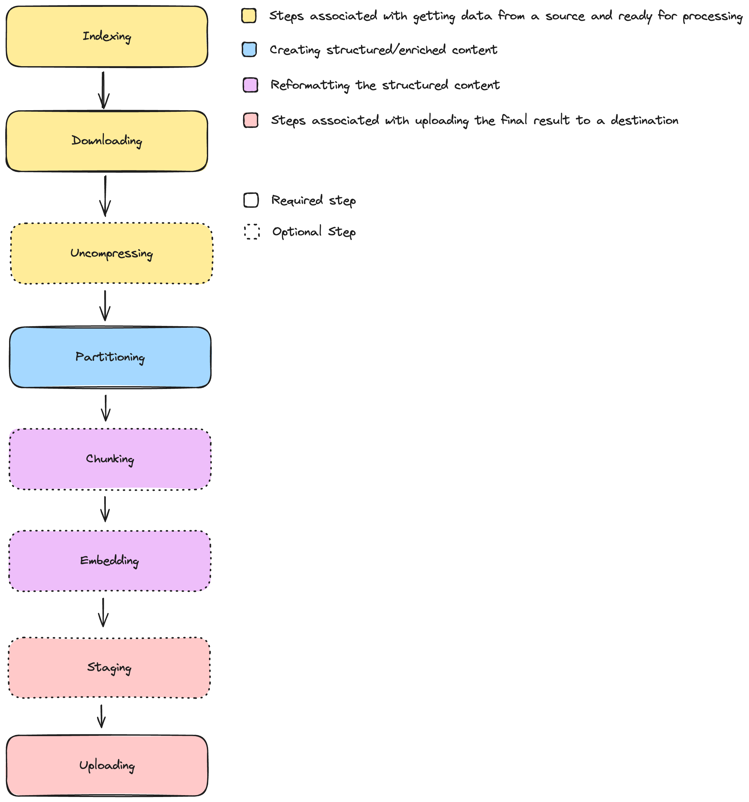
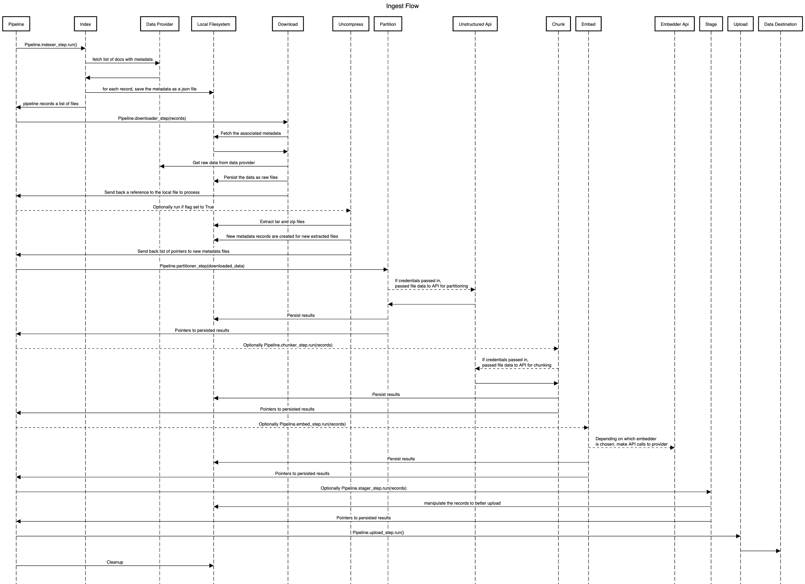

# Batch Processing Documents

## The unstructured-ingest CLI

The unstructured library includes a CLI to batch ingest documents from various sources, storing structured outputs locally on the filesystem.

For example, the following command processes all the documents in S3 in the
`utic-dev-tech-fixtures` bucket with a prefix of `small-pdf-set/`.

    unstructured-ingest \
       s3 \
       --remote-url s3://utic-dev-tech-fixtures/small-pdf-set/ \
       --anonymous \
       --output-dir s3-small-batch-output \
       --num-processes 2

Naturally, --num-processes may be adjusted for better instance utilization with multiprocessing. There is also an optional

Installation note: make sure to install the following extras when installing unstructured, needed for the above command:

    pip install "unstructured[s3,local-inference]"

See the [Quick Start](https://github.com/Unstructured-IO/unstructured#eight_pointed_black_star-quick-start) which documents how to pip install `dectectron2` and other OS dependencies, necessary for the parsing of .PDF files.

# Developers' Guide

## Local testing

When testing from a local checkout rather than a pip-installed version of `unstructured`,
just execute `unstructured/ingest/main.py`, e.g.:

    PYTHONPATH=. ./unstructured/ingest/v2/main.py \
       s3 \
       --remote-url s3://utic-dev-tech-fixtures/small-pdf-set/ \
       --anonymous \
       --output-dir s3-small-batch-output \
       --num-processes 2

## Adding Source Data Connectors

To add a source connector, refer to [local.py](unstructured/ingest/v2/processes/connectors/local.py) as an example that implements the two relevant abstract base classes with their associated configs.

If the connector has an available `fsspec` implementation, then refer to [s3.py](unstructured/ingest/v2/processes/connectors/fsspec/s3.py).

Make sure to update the source registry via `add_source_entry` using a unique key for the source type. This will expose it as an available connector.

Create at least one folder [examples/ingest](examples/ingest) with an easily reproducible
script that shows the new connector in action.

Finally, to ensure the connector remains stable, add a new script test_unstructured_ingest/test-ingest-\<the-new-data-source\>.sh similar to [test_unstructured_ingest/test-ingest-s3.sh](test_unstructured_ingest/test-ingest-s3.sh), and append a line invoking the new script in [test_unstructured_ingest/test-ingest.sh](test_unstructured_ingest/test-ingest.sh).

You'll notice that the unstructured outputs for the new documents are expected
to be checked into CI under test_unstructured_ingest/expected-structured-output/\<folder-name-relevant-to-your-dataset\>. So, you'll need to `git add` those json outputs so that `test-ingest.sh` passes in CI.

Double check that the connector is optimized for the best fan out, check [here](#parallel-execution) for more details.

## Adding Destination Data Connectors

To add a source connector, refer to [local.py](unstructured/ingest/v2/processes/connectors/local.py) as an example that implements the the uploader abstract base classes with the associated configs.

If the connector has an available `fsspec` implementation, then refer to [s3.py](unstructured/ingest/v2/processes/connectors/fsspec/s3.py).

Make sure to update the destination registry via `add_source_entry` using a unique key for the source type. This will expose it as an available connector.

Similar tests and examples should be added to demonstrate/validate the use of the destination connector similar to the steps laid out for a source connector.

Double check that the connector is optimized for the best fan out, check [here](#parallel-execution) for more details.

### The checklist:

In checklist form, the above steps are summarized as:

- [ ] Create a new file under [connectors/](unstructured/ingest/v2/processes/connectors/) implementing the the base classes required depending on if it's a new source or destination connector.
  - [ ] If the IngestDoc relies on a connection or session that could be reused, the subclass of `BaseConnectorConfig` implements a session handle to manage connections. The ConnectorConfig subclass should also inherit from `ConfigSessionHandleMixin` and the IngestDoc subclass should also inherit from `IngestDocSessionHandleMixin`. Check [here](https://github.com/Unstructured-IO/unstructured/pull/1058/files#diff-dae96d30f58cffe1b348c036d006b48bdc7e2e47fbd7c8ec1c45d63face1542d) for a detailed example.
  - [ ] Indexer should fetch appropriate metadata from the source that can be used to reference the doc in the pipeline and detect if there are any changes from what might already exist locally.
  - [ ] Add the relevant decorators from `unstructured.ingest.error` on top of relevant methods to handle errors such as a source connection error, destination connection error, or a partition error.
  - [ ] Register the required information via `add_source_entry` or `add_source_entry` to expose the new connectors.
- [ ] Update the CLI to expose the new connectors via CLI params
  - [ ] Add a new file under [cmds](unstructured/ingest/v2/cli/cmds)
  - [ ] Add the command base classes from the file above in the [__init__.py](unstructured/ingest/v2/cli/cmds/__init__.py). This will expose it in the CLI.
- [ ] Update [unstructured/ingest/cli](unstructured/ingest/cli) with support for the new connector.
- [ ] Create a folder under [examples/ingest](examples/ingest) that includes at least one well documented script.
- [ ] Add a script test_unstructured_ingest/[src|dest\/test-ingest-\<the-new-data-source\>.sh. It's json output files should have a total of no more than 100K.
- [ ] Git add the expected outputs under test_unstructured_ingest/expected-structured-output/\<folder-name-relevant-to-your-dataset\> so the above test passes in CI.
- [ ] Add a line to [test_unstructured_ingest/test-ingest.sh](test_unstructured_ingest/test-ingest.sh) invoking the new test script.
- [ ] Make sure the tests for the connector are running and not skipped by reviewing the logs in CI.
- [ ] If additional python dependencies are needed for the new connector:
  - [ ] Add them as an extra to [setup.py](unstructured/setup.py).
  - [ ] Update the Makefile, adding a target for `install-ingest-<name>` and adding another `pip-compile` line to the `pip-compile` make target. See [this commit](https://github.com/Unstructured-IO/unstructured/commit/ab542ca3c6274f96b431142262d47d727f309e37) for a reference.
  - [ ] The added dependencies should be imported at runtime when the new connector is invoked, rather than as top-level imports.
  - [ ] Add the decorator `unstructured.utils.requires_dependencies` on top of each class instance or function that uses those connector-specific dependencies e.g. for `GitHubConnector` should look like `@requires_dependencies(dependencies=["github"], extras="github")`
  - [ ] Run `make tidy` and `make check` to ensure linting checks pass.
- [ ] Update ingest documentation [here](https://github.com/Unstructured-IO/docs)
- [ ] For team members that are developing in the original repository:
  - [ ] If there are secret variables created for the connector tests, make sure to:
    - [ ] add the secrets into Github (contact someone with access)
    - [ ] include the secret variables in [`ci.yml`](https://github.com/Unstructured-IO/unstructured/blob/main/.github/workflows/ci.yml) and [`ingest-test-fixtures-update-pr.yml`](https://github.com/Unstructured-IO/unstructured/blob/main/.github/workflows/ingest-test-fixtures-update-pr.yml)
    - [ ] add a make install line in the workflow configurations to be able to provide the workflow machine with the required dependencies on the connector while testing
    - [ ] Whenever necessary, use the [ingest update test fixtures](https://github.com/Unstructured-IO/unstructured/actions/workflows/ingest-test-fixtures-update-pr.yml) workflow to update the test fixtures.

## Design References

The ingest flow is similar to an ETL pipeline that gets defined at runtime based on user input:

### Steps
* `Indexer`: This is responsible for reaching out to the source location and pulling in metadata for each document that will need to be downloaded and processed
* `Downloader`: Using the information generated from the indexer, download the content as files on the local file system for processing. This may require manipulation of the data to prep it for partitioning.
* `Uncompressor`: If enabled, this will look for any supported compressed files (tar and zip are currently supported) and expands those.
* `Partitioner`: Generated the structured enriched content from the local files that have been pulled down. Both local and api-based partitioning is supported, with api-based partitioning set to run async while local set to run via multiprocessing.
* `Chunker`: Optionally chunk the partitioned content. Can also be run locally or via the api, with async/multiprocessing set in the same approach as the partitioner.
* `Embedder`: Create vector embeddings for each element in the structured output. Most of these are via an API call (i.e. AWS Bedrock) and therefor run async but can also use a local huggingface model which will run via multiprocessing.
* `Stager`: This is an optional step that won't apply for most pipelines. If the data needs to be modified from the existing structure to better support the upload, such as converting it to a csv for tabular-based destinations (sql dbs).
* `Uploader`: Write the local content to the destination. If none if provided, the local one will be used which writes the final result to a location on the local filesystem. If batch uploads are needed, this will run in a single process with access to all docs. If batch is not supported, all docs can be uploaded concurrently using the async approach.

### Sequence Diagram

### Parallel Execution
For each step in the pipeline, a choice can be made when to run it async to support IO heavy tasks vs multiprocessing for CPU heavy loads. This choice should be make with care
because if enabling async, that code will be run in a single process with the assumption that the async support will provide better fan out and optimization that running the code
with a multiprocessing pool fan out. If the underlying code is completely blocking but the async flag is enabled, this will run as if it's a normal for loop and will get worse performance
than is simply run via multiprocessing. One option to help support IO heavy tasks that might not support async yet is wrapping it in a `run_in_executor()` call. Otherwise, it is common that
the underlying SDKs have an async version to run the same network calls without blocking the event loop.
